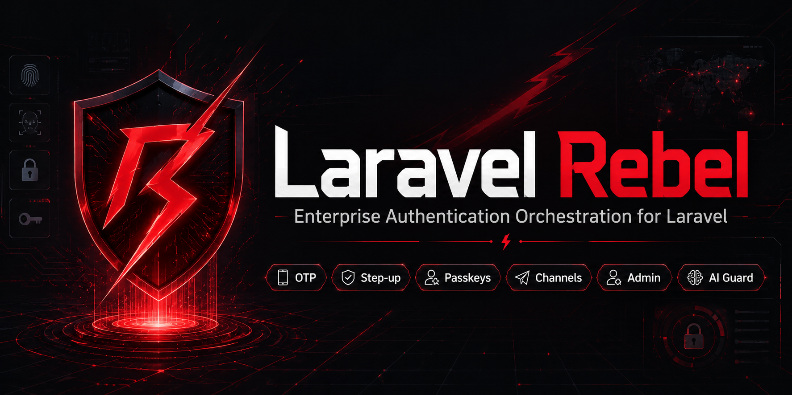
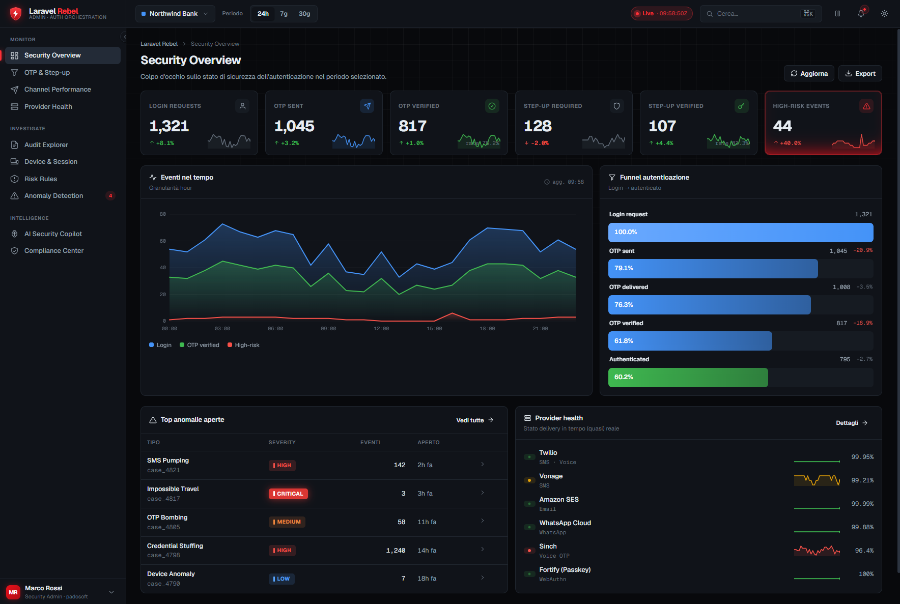

# Laravel Rebel — Core

> **Il cuore dell'ecosistema `padosoft/laravel-rebel-*`: un _control plane_ di autenticazione enterprise per Laravel** (passwordless OTP, passkey-first, step-up risk-based, SCA, multi-tenant, admin, AI). Questo package `-core` contiene i "mattoni" condivisi (value object, contratti, assurance, audit, hashing) su cui poggiano tutti gli altri.

<p align="center">
  
</p>

<p align="center">
  
  
  
  
  
</p>

<p align="center"><strong>Se è la prima volta che vedi questo progetto, parti da qui: questo README ti spiega TUTTO l'ecosistema.</strong></p>

---

## Indice

- [Cos'è Laravel Rebel (in 1 minuto)](#cosè-laravel-rebel-in-1-minuto)
- [Glossario (per chi non è esperto di auth)](#glossario-per-chi-non-è-esperto-di-auth)
- [La suite: tutti i package](#la-suite-tutti-i-package)
- [Come si incastrano (dependency DAG)](#come-si-incastrano-dependency-dag)
- [Web Admin Panel](#web-admin-panel)
- [Cosa fa questo package (`-core`)](#cosa-fa-questo-package--core)
- [Flussi end-to-end (esempi narrati)](#flussi-end-to-end-esempi-narrati)
- [Installazione (a prova di junior)](#installazione-a-prova-di-junior)
- [Configurazione (ogni opzione spiegata)](#configurazione-ogni-opzione-spiegata)
- [Esempi d'uso](#esempi-duso)
- [Compliance](#compliance)
- [Testing](#testing)
- [Licenza](#licenza)

---

## Cos'è Laravel Rebel (in 1 minuto)

Laravel ha già **Fortify** (login, registrazione, reset password, 2FA TOTP, passkey). Rebel **non lo sostituisce**: ci si mette _sopra_ e aggiunge ciò che serve a un prodotto **enterprise/ecommerce**:

- **login passwordless** (email-OTP stile Shopify) e **passkey-first** (il più sicuro);
- **step-up**: ri-chiedere una conferma forte solo per le **azioni sensibili** (cambia email, ordine a credito, scarica fattura…), con livello di sicurezza adeguato al rischio;
- **SCA / PSD2 dynamic linking** per i pagamenti/ordini a credito in UE;
- **canali** SMS/WhatsApp/voice con difese anti-frode;
- **multi-tenant**, **audit**, **admin web panel**, **AI guard**.

Tutto è diviso in **package piccoli e componibili**: usi solo ciò che ti serve.

> In una riga: **Rebel trasforma Laravel Fortify in un control plane di autenticazione enterprise.**

---

## Glossario (per chi non è esperto di auth)

| Termine | Significato semplice |
|---|---|
| **OTP** | "One-Time Password": un codice usa-e-getta (es. 6 cifre) inviato via email/SMS. |
| **Passwordless** | Login senza password: provi a essere te con un OTP o una passkey. |
| **Passkey / FIDO2 / WebAuthn** | Credenziale crittografica legata al tuo dispositivo (impronta/Face ID/chiave). È **phishing-resistant**. |
| **Phishing-resistant** | Non rigiocabile su un sito-truffa. Solo le passkey lo sono (OTP/SMS no). |
| **Step-up** | Alzare il livello di verifica per una singola azione sensibile, non per tutto il login. |
| **AAL (1/2/3)** | "Authenticator Assurance Level" (NIST): quanto è forte l'autenticazione. AAL1 = 1 fattore, AAL2 = 2 fattori, AAL3 = hardware. |
| **AMR** | "Authentication Methods References": _come_ ti sei autenticato (es. `['webauthn']`, `['otp','email']`). |
| **Dynamic linking (PSD2/SCA)** | La conferma di pagamento è legata a **importo + beneficiario**: se cambiano, decade. |
| **Pepper** | Una chiave segreta lato server usata per gli HMAC (così email/IP salvati non sono reversibili). |
| **Tenant** | Un "inquilino" in un sistema multi-cliente (es. sito/brand/nazione di un ecommerce). |

---

## La suite: tutti i package

| Package | A cosa serve | Cosa NON fa |
|---|---|---|
| **`laravel-rebel-core`** (questo) | Value object, contratti, assurance, audit, hashing condivisi | Niente route/UI; niente Fortify/Twilio/AI |
| `laravel-rebel-email-otp` | Login passwordless email-OTP (web + mobile/Sanctum) | Non gestisce SMS (vedi channels) |
| `laravel-rebel-bridge-fortify` | Usa Fortify (password-confirm, passkey, TOTP) come driver + login passkey-first | Non reimplementa Fortify |
| `laravel-rebel-step-up` | Step-up per azione/purpose, risk-based, con SCA dynamic linking | Non è il login (è la conferma di un'azione) |
| `laravel-rebel-channels` | Astrazione canali/provider + anti toll-fraud/IRSF + bot gate | Non è legato a un provider specifico |
| `laravel-rebel-channel-twilio` | Provider Twilio (SMS/WhatsApp/Voice, Verify, webhook) | — |
| `laravel-rebel-recovery` | Account recovery ad alta assurance + recovery codes | — |
| `laravel-rebel-sessions` | Device/sessione, "log out everywhere", refresh rotation | — |
| `laravel-rebel-admin-api` | Control plane JSON API (metriche, audit, anomalie) | Nessuna UI (solo API) |
| `laravel-rebel-admin` | **Web Admin Panel** (Blade + AJAX + vanilla JS) | — |
| `laravel-rebel-ai-guard` | Anomaly detection + AI copilot (spiega, non decide) | Non prende decisioni distruttive da solo |
| `laravel-rebel-auth` | Meta-package: installa il bundle consigliato | Niente logica di business |

---

## Come si incastrano (dependency DAG)

```text
                         laravel-rebel-core
                          (linguaggio comune)
        ┌───────────┬───────────┬─────────────┬───────────────┐
        ▼           ▼           ▼             ▼               ▼
   email-otp     channels    step-up   sessions/recovery   admin-api
        │           │           ▲                              │
        │           └──► channel-twilio                        │
        │                       │                              ▼
        └───────────────► bridge-fortify                     admin (web panel)
                                                                │
                                          ai-guard ── legge ────┘ (bucket/metriche)

Ordine d'installazione: core → email-otp → bridge-fortify → step-up →
channels (+twilio) → admin-api → admin → sessions/recovery → ai-guard.
```

Regole: il **core non dipende** da Fortify/Twilio/AI. L'**admin funziona senza ai-guard**. Il `fortify_password_confirm` è **web-only** (mobile usa step-up token-native).

---

## Web Admin Panel

La suite include un **pannello di amministrazione web** (package `laravel-rebel-admin`) — Blade + AJAX + vanilla JS, **senza** framework JS obbligatori — per monitorare login/OTP/step-up, salute dei provider, audit, anomalie e compliance.

<p align="center">
  
</p>

---

## Cosa fa questo package (`-core`)

Il core è **piccolo e stabile**: definisce il "linguaggio" condiviso. Contiene:

- **Identificatori** — `EmailIdentifier`, `PhoneIdentifier`, `GenericIdentifier`: normalizzano e mascherano email/telefono.
- **Hashing keyed** — `KeyedHasher`/`HmacKeyedHasher`: HMAC con **pepper versionato** e rotazione (per email/IP/OTP).
- **Assurance** — `Aal`, `AssuranceLevel`: il modello di sicurezza che impedisce, per esempio, a un email-OTP (AAL1) di "coprire" un'azione che richiede una passkey.
- **Contesto** — `SecurityContext`, `TenantContext`, `DeviceContext`: il contesto di una richiesta (IP/UA già hashati).
- **Rischio** — `RiskAssessment`, `RiskLevel`, `RecommendedAction`.
- **Auth** — `LoginResult` (web|token), `TokenPair` (Sanctum access+refresh).
- **Audit** — `AuditEvent`, `DatabaseAuditLogger` (+ tabella `rebel_auth_events`), `Redactor` (mai OTP/secret nei log).
- **Contratti** — `TokenIssuer`, `SubjectResolver`, `TenantResolver`, `RiskEvaluator`, `AuditLogger`, `SessionRegistry`, `DeviceTrust`, `BotProtection`, `RateLimiter`, `Clock` (PSR-20).
- **Tenancy** — `CurrentTenant` + trait `BelongsToTenant` (isolamento per tenant).
- **Config** — comando `php artisan rebel:validate-config` (fail-fast in CI).

---

## Flussi end-to-end (esempi narrati)

**1) Login passwordless (cliente ecommerce)**
```text
utente inserisce email
  → Rebel crea un challenge OTP, invia il codice (anti-enumeration: risposta sempre uguale)
  → utente inserisce il codice
  → verifica atomica (single-use) → login
       web    → sessione + cookie
       mobile → TokenPair Sanctum (access + refresh)
  → audit: email_otp.verified (aal1, amr ['otp','email'])
```

**2) Ordine a credito B2B (step-up + SCA)**
```text
utente clicca "Conferma ordine a credito €1.250 → ACME Srl"
  → middleware rebel.stepup:checkout-credit-order
  → richiesta richiede AAL2 phishing-resistant → preferita la passkey
  → la conferma è LEGATA a importo+beneficiario (dynamic linking):
       se cambia il totale del carrello → la conferma decade → ri-autentica
  → azione eseguita, audit con aal/amr e binding
```

**3) Account recovery (il punto più delicato)**
```text
utente ha perso l'accesso
  → recovery NON è "email un codice": è uno step-up ad assurance PIÙ ALTA del login
  → recovery code monouso + eventuale verifica identità
```

---

## Installazione (a prova di junior)

> Di solito non installi `-core` da solo: arriva come dipendenza degli altri package. Ma puoi usarlo stand-alone per i suoi value object/contratti.

**1. Richiedi il package**
```bash
composer require padosoft/laravel-rebel-core
```

**2. Pubblica la config (opzionale)**
```bash
php artisan vendor:publish --tag=rebel-core-config
```

**3. Imposta il pepper nel `.env`** (chiave segreta per gli HMAC)
```dotenv
# genera un valore robusto:  php -r "echo bin2hex(random_bytes(32));"
REBEL_PEPPER_V1=incolla-qui-un-valore-lungo-e-casuale
REBEL_PEPPER_CURRENT=1
```

**4. (Se usi l'audit) esegui le migration**
```bash
php artisan migrate
```

**5. Verifica la config**
```bash
php artisan rebel:validate-config
# -> "Configurazione Rebel valida."  (exit 0)
```

Fatto. Ora i contratti/value object sono disponibili.

---

## Configurazione (ogni opzione spiegata)

File: `config/rebel-core.php`

| Chiave | Default | Cosa fa | Quando cambiarla |
|---|---|---|---|
| `peppers` | `[1 => env('REBEL_PEPPER_V1')]` | Mappa `versione => segreto` per gli HMAC | Aggiungi una versione per **ruotare** il pepper |
| `pepper_current` | `1` | Versione usata per i **nuovi** hash | Quando ruoti, imposta la nuova versione |
| `hmac_algo` | `sha256` | Algoritmo HMAC | Raramente; deve essere supportato da PHP |
| `hash_ip` | `true` | Salva l'IP come HMAC (mai in chiaro) | Lascialo `true` per GDPR |
| `hash_user_agent` | `true` | Salva lo User-Agent come HMAC | Lascialo `true` per GDPR |

**Rotazione del pepper (esempio):**
```php
// config/rebel-core.php
'peppers' => [
    1 => env('REBEL_PEPPER_V1'),
    2 => env('REBEL_PEPPER_V2'), // nuovo segreto
],
'pepper_current' => 2, // i nuovi hash usano v2; i vecchi (v1) restano verificabili
```

---

## Esempi d'uso

**Identificatori (normalizzazione + masking)**
```php
use Padosoft\Rebel\Core\Identifiers\EmailIdentifier;
use Padosoft\Rebel\Core\Identifiers\PhoneIdentifier;

$email = EmailIdentifier::from('  Mario.Rossi@Example.IT ');
$email->normalized(); // "mario.rossi@example.it"  (per lookup/HMAC)
$email->masked();     // "m***@example.it"          (per UI/log)

PhoneIdentifier::from('+39 328 000 0000')->normalized(); // "+393280000000"
```

**Hashing keyed (con rotazione)**
```php
use Padosoft\Rebel\Core\Contracts\KeyedHasher;

$hasher = app(KeyedHasher::class);
$h = $hasher->hash($email->normalized());   // HashedValue(hash, keyVersion)
$hasher->matches($email->normalized(), $h->hash, $h->keyVersion); // true (constant-time)
```

**Assurance (la regola di sicurezza centrale)**
```php
use Padosoft\Rebel\Core\Assurance\Aal;
use Padosoft\Rebel\Core\Assurance\AssuranceLevel;

$emailOtp = new AssuranceLevel(Aal::Aal1, phishingResistant: false, amr: ['otp', 'email']);
$passkey  = new AssuranceLevel(Aal::Aal2, phishingResistant: true,  amr: ['webauthn']);

// Un'azione che richiede AAL2 phishing-resistant:
$emailOtp->satisfies(Aal::Aal2, requirePhishingResistant: true); // false  ← email-OTP non basta
$passkey->satisfies(Aal::Aal2, requirePhishingResistant: true);  // true
```

**SecurityContext da una richiesta**
```php
use Padosoft\Rebel\Core\Context\SecurityContext;
use Padosoft\Rebel\Core\Contracts\KeyedHasher;

$ctx = SecurityContext::fromRequest($request, app(KeyedHasher::class))
    ->withGuard('customers')
    ->withPurpose('customer-login')
    ->withIdentifier($email);
// $ctx->ipHmac / $ctx->userAgentHash sono già hashati (mai in chiaro)
```

**Audit (con redazione automatica dei segreti)**
```php
use Padosoft\Rebel\Core\Audit\AuditEvent;
use Padosoft\Rebel\Core\Audit\AuthEventType;
use Padosoft\Rebel\Core\Contracts\AuditLogger;

app(AuditLogger::class)->record(new AuditEvent(
    type: AuthEventType::EmailOtpVerified->value,
    guard: 'customers',
    identifierHmac: $h->hash, keyVersion: $h->keyVersion,
    purpose: 'customer-login',
    aal: Aal::Aal1, amr: ['otp', 'email'],
    metadata: ['otp' => '123456'], // ← verrà salvato come "[REDACTED]"
));
```

**Tenancy (isolamento per tenant)**
```php
use Padosoft\Rebel\Core\Tenancy\CurrentTenant;

app(CurrentTenant::class)->set('site-it'); // di solito lo fa il TenantResolver/middleware
// Tutti i modelli Rebel con BelongsToTenant ora filtrano e timbrano tenant_id = 'site-it'
```

**Tempo testabile (Clock PSR-20)**
```php
use Padosoft\Rebel\Core\Clock\FakeClock;
use Psr\Clock\ClockInterface;

$clock = new FakeClock(new DateTimeImmutable('2026-01-01 10:00:00'));
app()->instance(ClockInterface::class, $clock);
$clock->advance(600); // simula +10 minuti (utile per testare scadenze OTP/step-up)
```

---

## Compliance

Rebel è progettato _by-design_ su standard riconosciuti (dettagli nelle ADR/`docs/`):

- **NIST 800-63B-4** — modello AAL/AMR; email-OTP = AAL1; SMS = "restricted"; solo passkey è phishing-resistant.
- **PSD2 / SCA** — dynamic linking per ordini a credito B2B (non sostituisce il 3DS2 del PSP per le carte).
- **GDPR** — IP/identificatori come HMAC keyed + `key_version` (rotazione), redazione log, niente PII in chiaro.

Vedi `docs/adr/ADR-0005-design-lock.md`.

---

## Testing

```bash
composer test       # Pest
composer phpstan    # analisi statica (livello max)
composer pint       # code style
```

---

## Licenza

MIT — vedi [LICENSE](LICENSE). © Padosoft.
