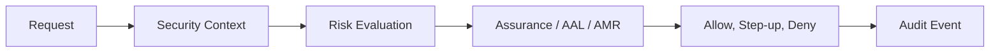

# Gotchas and Limits

## Motivazione

`Gotchas and Limits` keeps the Laravel Rebel ecosystem understandable as separate packages evolve independently. Each package owns a narrow responsibility while the core package defines the shared language of assurance, context, audit and contracts.

## Teoria

Model an authentication decision as tuple $D=(s,a,c,r)$ where $s$ is subject, $a$ is assurance, $c$ is request context and $r$ is risk.

$$
allowed(D, action)=assurance(D) \geq required(action) \land risk(D) \leq threshold(action)
$$

## Design + diagramma



## Modello dati / contratto

| Contract area | Owner | Notes |
|---|---|---|
| Assurance and AMR | `laravel-rebel-core` | Stable language shared by every package. |
| Challenge lifecycle | OTP, step-up and bridge packages | Must be single-use and bounded by time. |
| Delivery result | `laravel-rebel-channels` providers | Must not be confused with authentication success. |
| Operations view | admin API and admin UI | Reads metrics, events and anomalies. |

## ADR

::: collapsible "Problem: package boundaries can drift"
Decision: keep feature packages small and document ownership in this central site.

Consequences: installation is modular, but docs must explain composition instead of only individual APIs.
:::

::: collapsible "Problem: assurance evidence is provider-specific"
Decision: normalize evidence through core contracts and value objects.

Consequences: provider packages can change without changing application policy.
:::

## Worked example

```php
if (! $assurance->satisfies($required)) {
    return $stepUp->challenge($user, purpose: 'change-payout-account');
}

$audit->record('rebel.action.confirmed', [
    'purpose' => 'change-payout-account',
    'aal' => $assurance->level()->value,
]);
```

::: callout warning
Never log OTP codes, recovery secrets, passkey raw challenges, provider tokens or webhook secrets.
:::
