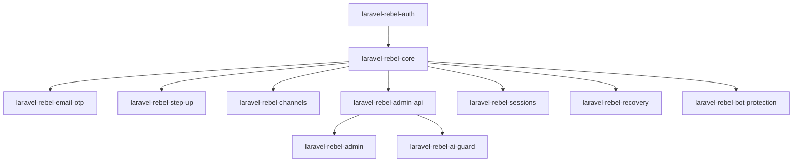

# Dependency Graph

Let package dependencies be a directed graph $G=(V,E)$. Rebel keeps high-volatility integrations at graph leaves, minimizing blast radius.

$$
R(v)=\frac{outdegree(v)}{indegree(v)+1}
$$
