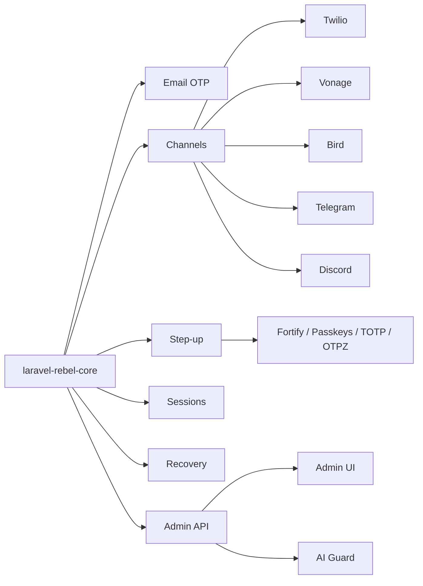

# Laravel Rebel

Centralized documentation for the 22-package `padosoft/laravel-rebel-*` ecosystem.

::: callout info
This site is intentionally centralized in `laravel-rebel-core/doc-site`. Every package README points here: `https://doc.laravel-rebel.padosoft.com`.
:::

::: grids
::: grid
::: card "laravel-rebel-bridge-passkeys" icon:package
WebAuthn passkey step-up driver for Laravel Rebel: bridges spatie/laravel-passkeys into Rebel's step-up registry, issuing phishing-resistant AAL3 challenges.

[GitHub](https://github.com/padosoft/laravel-rebel-bridge-passkeys) · [Reference](/packages/bridge-passkeys)
:::
:::
::: grid
::: card "laravel-rebel-bridge-spatie-otp" icon:package
Bridge between spatie/laravel-one-time-passwords and Laravel Rebel: exposes email/SMS OTP as an AAL2 step-up driver with full audit telemetry. Part of padosoft/laravel-rebel-*.

[GitHub](https://github.com/padosoft/laravel-rebel-bridge-spatie-otp) · [Reference](/packages/bridge-spatie-otp)
:::
:::
::: grid
::: card "laravel-rebel-channel-bird" icon:package
Bird (formerly MessageBird) provider for Laravel Rebel Channels: phone verification via the Bird Verify API (SMS), plain SMS delivery, and signed delivery-status webhooks. Part of padosoft/laravel-rebel-*.

[GitHub](https://github.com/padosoft/laravel-rebel-channel-bird) · [Reference](/packages/channel-bird)
:::
:::
::: grid
::: card "laravel-rebel-channel-discord" icon:package
Discord delivery channel for Laravel Rebel Channels: ship security/SOC alerts (anomaly cases, lockouts, high-risk events) and notifications to a Discord channel via webhook. Part of padosoft/laravel-rebel-*.

[GitHub](https://github.com/padosoft/laravel-rebel-channel-discord) · [Reference](/packages/channel-discord)
:::
:::
::: grid
::: card "laravel-rebel-channels" icon:package
Channel/provider abstraction (SMS/WhatsApp/voice) for Laravel Rebel: verification routing with fallback, cooldown, multi-dimensional rate limiting, and anti toll-fraud/IRSF defences. Part of padosoft/laravel-rebel-*.

[GitHub](https://github.com/padosoft/laravel-rebel-channels) · [Reference](/packages/channels)
:::
:::
::: grid
::: card "laravel-rebel-channel-telegram" icon:package
Telegram bot delivery channel for Laravel Rebel Channels: deliver OTP codes and security alerts to a Telegram chat. Part of padosoft/laravel-rebel-*.

[GitHub](https://github.com/padosoft/laravel-rebel-channel-telegram) · [Reference](/packages/channel-telegram)
:::
:::
::: grid
::: card "laravel-rebel-channel-twilio" icon:package
Twilio provider for Laravel Rebel Channels: phone verification via Twilio Verify (SMS/WhatsApp/voice), message delivery, and signed delivery-status webhooks. Part of padosoft/laravel-rebel-*.

[GitHub](https://github.com/padosoft/laravel-rebel-channel-twilio) · [Reference](/packages/channel-twilio)
:::
:::
::: grid
::: card "laravel-rebel-channel-vonage" icon:package
Vonage provider for Laravel Rebel Channels: phone verification via Vonage Verify (SMS/voice), plain SMS delivery, and signed delivery-receipt webhooks. Part of padosoft/laravel-rebel-*.

[GitHub](https://github.com/padosoft/laravel-rebel-channel-vonage) · [Reference](/packages/channel-vonage)
:::
:::
::: grid
::: card "laravel-rebel-core" icon:package
Core primitives, value objects and contracts for Laravel Rebel: the enterprise authentication control plane (AAL/AMR assurance, security context, audit, Sanctum tokens, rate-limiting). The entry point of the padosoft/laravel-rebel-* ecosystem.

[GitHub](https://github.com/padosoft/laravel-rebel-core) · [Reference](/packages/core)
:::
:::
::: grid
::: card "laravel-rebel-demo" icon:package
Demo / integration application for the padosoft/laravel-rebel-* enterprise authentication suite.

[GitHub](https://github.com/padosoft/laravel-rebel-demo) · [Reference](/packages/demo)
:::
:::
::: grid
::: card "laravel-rebel-email-otp" icon:package
Enterprise passwordless email-OTP login for Laravel Rebel: anti-enumeration, multi-dimensional rate-limiting, multi-tenant/purpose/risk, Sanctum token issuance. Part of padosoft/laravel-rebel-*.

[GitHub](https://github.com/padosoft/laravel-rebel-email-otp) · [Reference](/packages/email-otp)
:::
:::
::: grid
::: card "laravel-rebel-recovery" icon:package
High-assurance account recovery for Laravel Rebel: single-use HMAC-hashed recovery (backup) codes, generated once at enrolment, with anti-ATO checks. Part of padosoft/laravel-rebel-*.

[GitHub](https://github.com/padosoft/laravel-rebel-recovery) · [Reference](/packages/recovery)
:::
:::
::: grid
::: card "laravel-rebel-sessions" icon:package
Device/session registry for Laravel Rebel: session/device tracking, logout-everywhere, refresh-token rotation with reuse detection, and device trust. Part of padosoft/laravel-rebel-*.

[GitHub](https://github.com/padosoft/laravel-rebel-sessions) · [Reference](/packages/sessions)
:::
:::
::: grid
::: card "laravel-rebel-step-up" icon:package
Step-up authentication for Laravel Rebel: confirm an action/purpose with AAL/AMR assurance, risk-based, and PSD2/SCA dynamic linking. Part of padosoft/laravel-rebel-*.

[GitHub](https://github.com/padosoft/laravel-rebel-step-up) · [Reference](/packages/step-up)
:::
:::
::: grid
::: card "laravel-rebel-admin" icon:package
Web Admin Panel (Blade + AJAX + vanilla JS) for Laravel Rebel: a security operations dashboard over the Rebel Admin API. Part of padosoft/laravel-rebel-*.

[GitHub](https://github.com/padosoft/laravel-rebel-admin) · [Reference](/packages/admin)
:::
:::
::: grid
::: card "laravel-rebel-admin-api" icon:package
Control-plane JSON API for Laravel Rebel: security metrics, audit-event explorer, OTP/step-up funnels, provider health, with permission-gated and tenant-scoped read models. Part of padosoft/laravel-rebel-*.

[GitHub](https://github.com/padosoft/laravel-rebel-admin-api) · [Reference](/packages/admin-api)
:::
:::
::: grid
::: card "laravel-rebel-ai-guard" icon:package
Anomaly detection + AI security copilot for Laravel Rebel: deterministic rules detect anomaly cases; the optional AI only explains/suggests (sanitized prompts, no PII/OTP, human review). Part of padosoft/laravel-rebel-*.

[GitHub](https://github.com/padosoft/laravel-rebel-ai-guard) · [Reference](/packages/ai-guard)
:::
:::
::: grid
::: card "laravel-rebel-auth" icon:package
Meta-package for the padosoft/laravel-rebel-* enterprise authentication control plane: passwordless email-OTP, passkey-first, risk-based step-up with PSD2/SCA, channels, sessions, recovery, anomaly detection and a web admin panel — installs and ties the whole suite together.

[GitHub](https://github.com/padosoft/laravel-rebel-auth) · [Reference](/packages/auth)
:::
:::
::: grid
::: card "laravel-rebel-bot-protection" icon:package
Pluggable anti-bot / CAPTCHA gate for Laravel Rebel: server-side verification of Cloudflare Turnstile, Google reCAPTCHA v3 and hCaptcha tokens, fail-closed by default and fully audited. Part of padosoft/laravel-rebel-*.

[GitHub](https://github.com/padosoft/laravel-rebel-bot-protection) · [Reference](/packages/bot-protection)
:::
:::
::: grid
::: card "laravel-rebel-bridge-fortify" icon:package
Bridge between Laravel Fortify and Laravel Rebel: exposes password-confirm / passkey / TOTP as step-up drivers, maps Fortify events into the Rebel audit trail, and enables passkey-first login. Part of padosoft/laravel-rebel-*.

[GitHub](https://github.com/padosoft/laravel-rebel-bridge-fortify) · [Reference](/packages/bridge-fortify)
:::
:::
::: grid
::: card "laravel-rebel-bridge-laragear-2fa" icon:package
Bridge between laragear/two-factor and Laravel Rebel: exposes TOTP as an AAL2 step-up driver, integrates recovery codes, and emits full audit telemetry into the Rebel audit trail. Part of padosoft/laravel-rebel-*.

[GitHub](https://github.com/padosoft/laravel-rebel-bridge-laragear-2fa) · [Reference](/packages/bridge-laragear-2fa)
:::
:::
::: grid
::: card "laravel-rebel-bridge-otpz" icon:package
Bridge the benbjurstrom/otpz email one-time-password package into Laravel Rebel step-up. Exposes OTP email magic-code as a step-up driver (AAL2, AMR otp). Part of padosoft/laravel-rebel-*.

[GitHub](https://github.com/padosoft/laravel-rebel-bridge-otpz) · [Reference](/packages/bridge-otpz)
:::
:::
:::

## Package index

| Package | Responsibility | Composer name |
|---|---|---|
| [`laravel-rebel-bridge-passkeys`](https://github.com/padosoft/laravel-rebel-bridge-passkeys) | WebAuthn passkey step-up driver for Laravel Rebel: bridges spatie/laravel-passkeys into Rebel's step-up registry, issuing phishing-resistant AAL3 challenges. | `padosoft/laravel-rebel-bridge-passkeys` |
| [`laravel-rebel-bridge-spatie-otp`](https://github.com/padosoft/laravel-rebel-bridge-spatie-otp) | Bridge between spatie/laravel-one-time-passwords and Laravel Rebel: exposes email/SMS OTP as an AAL2 step-up driver with full audit telemetry. Part of padosoft/laravel-rebel-*. | `padosoft/laravel-rebel-bridge-spatie-otp` |
| [`laravel-rebel-channel-bird`](https://github.com/padosoft/laravel-rebel-channel-bird) | Bird (formerly MessageBird) provider for Laravel Rebel Channels: phone verification via the Bird Verify API (SMS), plain SMS delivery, and signed delivery-status webhooks. Part of padosoft/laravel-rebel-*. | `padosoft/laravel-rebel-channel-bird` |
| [`laravel-rebel-channel-discord`](https://github.com/padosoft/laravel-rebel-channel-discord) | Discord delivery channel for Laravel Rebel Channels: ship security/SOC alerts (anomaly cases, lockouts, high-risk events) and notifications to a Discord channel via webhook. Part of padosoft/laravel-rebel-*. | `padosoft/laravel-rebel-channel-discord` |
| [`laravel-rebel-channels`](https://github.com/padosoft/laravel-rebel-channels) | Channel/provider abstraction (SMS/WhatsApp/voice) for Laravel Rebel: verification routing with fallback, cooldown, multi-dimensional rate limiting, and anti toll-fraud/IRSF defences. Part of padosoft/laravel-rebel-*. | `padosoft/laravel-rebel-channels` |
| [`laravel-rebel-channel-telegram`](https://github.com/padosoft/laravel-rebel-channel-telegram) | Telegram bot delivery channel for Laravel Rebel Channels: deliver OTP codes and security alerts to a Telegram chat. Part of padosoft/laravel-rebel-*. | `padosoft/laravel-rebel-channel-telegram` |
| [`laravel-rebel-channel-twilio`](https://github.com/padosoft/laravel-rebel-channel-twilio) | Twilio provider for Laravel Rebel Channels: phone verification via Twilio Verify (SMS/WhatsApp/voice), message delivery, and signed delivery-status webhooks. Part of padosoft/laravel-rebel-*. | `padosoft/laravel-rebel-channel-twilio` |
| [`laravel-rebel-channel-vonage`](https://github.com/padosoft/laravel-rebel-channel-vonage) | Vonage provider for Laravel Rebel Channels: phone verification via Vonage Verify (SMS/voice), plain SMS delivery, and signed delivery-receipt webhooks. Part of padosoft/laravel-rebel-*. | `padosoft/laravel-rebel-channel-vonage` |
| [`laravel-rebel-core`](https://github.com/padosoft/laravel-rebel-core) | Core primitives, value objects and contracts for Laravel Rebel: the enterprise authentication control plane (AAL/AMR assurance, security context, audit, Sanctum tokens, rate-limiting). The entry point of the padosoft/laravel-rebel-* ecosystem. | `padosoft/laravel-rebel-core` |
| [`laravel-rebel-demo`](https://github.com/padosoft/laravel-rebel-demo) | Demo / integration application for the padosoft/laravel-rebel-* enterprise authentication suite. | `padosoft/laravel-rebel-demo` |
| [`laravel-rebel-email-otp`](https://github.com/padosoft/laravel-rebel-email-otp) | Enterprise passwordless email-OTP login for Laravel Rebel: anti-enumeration, multi-dimensional rate-limiting, multi-tenant/purpose/risk, Sanctum token issuance. Part of padosoft/laravel-rebel-*. | `padosoft/laravel-rebel-email-otp` |
| [`laravel-rebel-recovery`](https://github.com/padosoft/laravel-rebel-recovery) | High-assurance account recovery for Laravel Rebel: single-use HMAC-hashed recovery (backup) codes, generated once at enrolment, with anti-ATO checks. Part of padosoft/laravel-rebel-*. | `padosoft/laravel-rebel-recovery` |
| [`laravel-rebel-sessions`](https://github.com/padosoft/laravel-rebel-sessions) | Device/session registry for Laravel Rebel: session/device tracking, logout-everywhere, refresh-token rotation with reuse detection, and device trust. Part of padosoft/laravel-rebel-*. | `padosoft/laravel-rebel-sessions` |
| [`laravel-rebel-step-up`](https://github.com/padosoft/laravel-rebel-step-up) | Step-up authentication for Laravel Rebel: confirm an action/purpose with AAL/AMR assurance, risk-based, and PSD2/SCA dynamic linking. Part of padosoft/laravel-rebel-*. | `padosoft/laravel-rebel-step-up` |
| [`laravel-rebel-admin`](https://github.com/padosoft/laravel-rebel-admin) | Web Admin Panel (Blade + AJAX + vanilla JS) for Laravel Rebel: a security operations dashboard over the Rebel Admin API. Part of padosoft/laravel-rebel-*. | `padosoft/laravel-rebel-admin` |
| [`laravel-rebel-admin-api`](https://github.com/padosoft/laravel-rebel-admin-api) | Control-plane JSON API for Laravel Rebel: security metrics, audit-event explorer, OTP/step-up funnels, provider health, with permission-gated and tenant-scoped read models. Part of padosoft/laravel-rebel-*. | `padosoft/laravel-rebel-admin-api` |
| [`laravel-rebel-ai-guard`](https://github.com/padosoft/laravel-rebel-ai-guard) | Anomaly detection + AI security copilot for Laravel Rebel: deterministic rules detect anomaly cases; the optional AI only explains/suggests (sanitized prompts, no PII/OTP, human review). Part of padosoft/laravel-rebel-*. | `padosoft/laravel-rebel-ai-guard` |
| [`laravel-rebel-auth`](https://github.com/padosoft/laravel-rebel-auth) | Meta-package for the padosoft/laravel-rebel-* enterprise authentication control plane: passwordless email-OTP, passkey-first, risk-based step-up with PSD2/SCA, channels, sessions, recovery, anomaly detection and a web admin panel — installs and ties the whole suite together. | `padosoft/laravel-rebel-auth` |
| [`laravel-rebel-bot-protection`](https://github.com/padosoft/laravel-rebel-bot-protection) | Pluggable anti-bot / CAPTCHA gate for Laravel Rebel: server-side verification of Cloudflare Turnstile, Google reCAPTCHA v3 and hCaptcha tokens, fail-closed by default and fully audited. Part of padosoft/laravel-rebel-*. | `padosoft/laravel-rebel-bot-protection` |
| [`laravel-rebel-bridge-fortify`](https://github.com/padosoft/laravel-rebel-bridge-fortify) | Bridge between Laravel Fortify and Laravel Rebel: exposes password-confirm / passkey / TOTP as step-up drivers, maps Fortify events into the Rebel audit trail, and enables passkey-first login. Part of padosoft/laravel-rebel-*. | `padosoft/laravel-rebel-bridge-fortify` |
| [`laravel-rebel-bridge-laragear-2fa`](https://github.com/padosoft/laravel-rebel-bridge-laragear-2fa) | Bridge between laragear/two-factor and Laravel Rebel: exposes TOTP as an AAL2 step-up driver, integrates recovery codes, and emits full audit telemetry into the Rebel audit trail. Part of padosoft/laravel-rebel-*. | `padosoft/laravel-rebel-bridge-laragear-2fa` |
| [`laravel-rebel-bridge-otpz`](https://github.com/padosoft/laravel-rebel-bridge-otpz) | Bridge the benbjurstrom/otpz email one-time-password package into Laravel Rebel step-up. Exposes OTP email magic-code as a step-up driver (AAL2, AMR otp). Part of padosoft/laravel-rebel-*. | `padosoft/laravel-rebel-bridge-otpz` |

## First principles

Laravel Rebel is an enterprise authentication control plane. It separates primitive assurance concepts from delivery channels, step-up decisions, admin operations, AI-assisted investigation, recovery, session governance and framework bridges.

