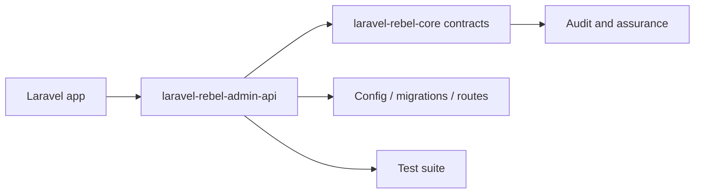

# laravel-rebel-admin-api

[GitHub repository](https://github.com/padosoft/laravel-rebel-admin-api) · Composer package: `padosoft/laravel-rebel-admin-api`

## Motivazione

Control-plane JSON API for Laravel Rebel: security metrics, audit-event explorer, OTP/step-up funnels, provider health, with permission-gated and tenant-scoped read models. Part of padosoft/laravel-rebel-*.

This package participates in the Laravel Rebel ecosystem by contributing one bounded capability to the authentication control plane.

## Teoria

A Rebel package should expose a capability $C$ without redefining the global assurance model $A$. Formally, the package contributes evidence $e$ and configuration $k$:

$$
C(package)=f(e,k) \quad \text{while} \quad A \in core
$$

## Design + diagramma



## Modello dati / contratto

### Runtime files

- `src\Console\ProjectMetricsCommand.php`
- `src\Http\Concerns\ResolvesTenant.php`
- `src\Http\Controllers\AiCopilotController.php`
- `src\Http\Controllers\AnomaliesController.php`
- `src\Http\Controllers\AuthEventsController.php`
- `src\Http\Controllers\ChannelsController.php`
- `src\Http\Controllers\ComplianceController.php`
- `src\Http\Controllers\FunnelController.php`
- `src\Http\Controllers\HealthController.php`
- `src\Http\Controllers\MeController.php`
- `src\Http\Controllers\OverviewController.php`
- `src\Http\Controllers\ProvidersController.php`
- `src\Http\Controllers\RiskRulesController.php`
- `src\Http\Controllers\SettingsController.php`
- `src\Http\Controllers\SubjectsController.php`
- `src\Http\Middleware\EnsureAdmin.php`
- `src\Metrics\MetricsProjector.php`
- `src\Models\AdminSetting.php`
- `src\Models\MetricBucket.php`
- `src\Models\RiskRule.php`
- `src\Risk\RiskRuleEvaluator.php`
- `src\Support\AdminAudit.php`
- `src\Support\Period.php`
- `src\RebelAdminApiServiceProvider.php`

### Service providers

- `src\Http\Controllers\ProvidersController.php`
- `src\RebelAdminApiServiceProvider.php`

### Services and managers

- `src\RebelAdminApiServiceProvider.php`

### Contracts

None detected in the package tree.

### Controllers

- `src\Http\Controllers\AiCopilotController.php`
- `src\Http\Controllers\AnomaliesController.php`
- `src\Http\Controllers\AuthEventsController.php`
- `src\Http\Controllers\ChannelsController.php`
- `src\Http\Controllers\ComplianceController.php`
- `src\Http\Controllers\FunnelController.php`
- `src\Http\Controllers\HealthController.php`
- `src\Http\Controllers\MeController.php`
- `src\Http\Controllers\OverviewController.php`
- `src\Http\Controllers\ProvidersController.php`
- `src\Http\Controllers\RiskRulesController.php`
- `src\Http\Controllers\SettingsController.php`
- `src\Http\Controllers\SubjectsController.php`

### Middleware

- `src\Http\Middleware\EnsureAdmin.php`

### Models

- `src\Models\AdminSetting.php`
- `src\Models\MetricBucket.php`
- `src\Models\RiskRule.php`

### Config

- `config\rebel-admin-api.php`

### Migrations

- `database\migrations\create_rebel_admin_settings_table.php`
- `database\migrations\create_rebel_metric_buckets_table.php`
- `database\migrations\create_rebel_risk_rules_table.php`

### Routes

- `routes\api.php`

### Commands

- `src\Console\ProjectMetricsCommand.php`

## Composer requirements

| Dependency | Constraint |
|---|---|
| `illuminate/contracts` | `^12.0|^13.0` |
| `illuminate/support` | `^12.0|^13.0` |
| `padosoft/laravel-rebel-core` | `^0.1` |
| `php` | `^8.3` |
| `spatie/laravel-package-tools` | `^1.92` |

## Development requirements

| Dependency | Constraint |
|---|---|
| `larastan/larastan` | `^3.0` |
| `laravel/pint` | `^1.18` |
| `orchestra/testbench` | `^10.0|^11.0` |
| `padosoft/laravel-rebel-ai-guard` | `^0.1` |
| `padosoft/laravel-rebel-sessions` | `^0.1` |
| `padosoft/laravel-rebel-step-up` | `^0.1` |
| `pestphp/pest` | `^4.0` |
| `pestphp/pest-plugin-laravel` | `^4.0` |

## ADR

::: collapsible "Problem: keep laravel-rebel-admin-api replaceable"
Decision: document its public responsibility and use Rebel core contracts at integration boundaries.

Consequences: applications can adopt the package without coupling every other Rebel module to its internals.
:::

::: collapsible "Problem: package-specific behavior must remain auditable"
Decision: all security-significant outcomes should emit or feed audit events through the core vocabulary.

Consequences: admin API, admin UI and AI guard can reason across packages without bespoke parsers for every provider.
:::

## Worked example

```bash
composer require padosoft/laravel-rebel-admin-api
php artisan vendor:publish
php artisan migrate
```

## Test and verification surface

- `tests\Feature\AdminGateTest.php`
- `tests\Feature\AiCopilotTest.php`
- `tests\Feature\AnomaliesTest.php`
- `tests\Feature\AuthEventDetailTest.php`
- `tests\Feature\AuthEventsExplorerTest.php`
- `tests\Feature\ChannelsProvidersTest.php`
- `tests\Feature\ComplianceMeSettingsTest.php`
- `tests\Feature\FunnelsTest.php`
- `tests\Feature\MetricsProjectorTest.php`
- `tests\Feature\OverviewTest.php`
- `tests\Feature\RiskRulesTest.php`
- `tests\Feature\SubjectsTest.php`
- `tests\Pest.php`
- `tests\TestCase.php`

::: callout warning
Do not copy internal test-only classes into an application. Treat file lists as a source map for maintainers and auditors, not as an installation recipe by themselves.
:::
