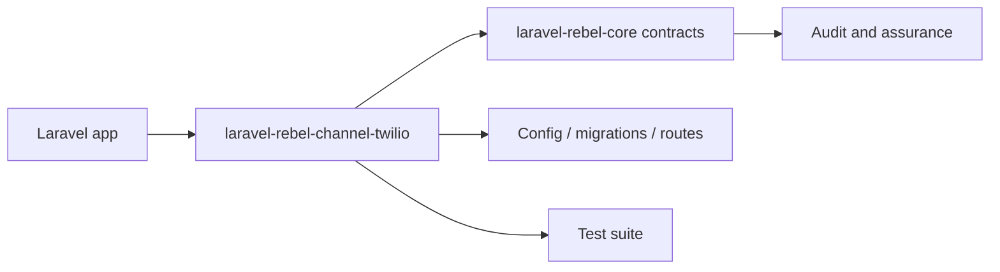

# laravel-rebel-channel-twilio

[GitHub repository](https://github.com/padosoft/laravel-rebel-channel-twilio) · Composer package: `padosoft/laravel-rebel-channel-twilio`

## Motivazione

Twilio provider for Laravel Rebel Channels: phone verification via Twilio Verify (SMS/WhatsApp/voice), message delivery, and signed delivery-status webhooks. Part of padosoft/laravel-rebel-*.

This package participates in the Laravel Rebel ecosystem by contributing one bounded capability to the authentication control plane.

## Teoria

A Rebel package should expose a capability $C$ without redefining the global assurance model $A$. Formally, the package contributes evidence $e$ and configuration $k$:

$$
C(package)=f(e,k) \quad \text{while} \quad A \in core
$$

## Design + diagramma



## Modello dati / contratto

### Runtime files

- `src\Contracts\TwilioVerifyGateway.php`
- `src\Gateway\RestTwilioVerifyGateway.php`
- `src\Http\Controllers\TwilioStatusController.php`
- `src\Http\TwilioSignatureValidator.php`
- `src\Testing\FakeTwilioVerifyGateway.php`
- `src\Verification\TwilioVerifyProvider.php`
- `src\RebelTwilioServiceProvider.php`

### Service providers

- `src\Verification\TwilioVerifyProvider.php`
- `src\RebelTwilioServiceProvider.php`

### Services and managers

- `src\RebelTwilioServiceProvider.php`

### Contracts

- `src\Contracts\TwilioVerifyGateway.php`

### Controllers

- `src\Http\Controllers\TwilioStatusController.php`

### Middleware

None detected in the package tree.

### Models

None detected in the package tree.

### Config

- `config\rebel-channel-twilio.php`

### Migrations

None detected in the package tree.

### Routes

None detected in the package tree.

### Commands

None detected in the package tree.

## Composer requirements

| Dependency | Constraint |
|---|---|
| `illuminate/contracts` | `^12.0|^13.0` |
| `illuminate/support` | `^12.0|^13.0` |
| `padosoft/laravel-rebel-channels` | `^0.1` |
| `padosoft/laravel-rebel-core` | `^0.1` |
| `php` | `^8.3` |
| `spatie/laravel-package-tools` | `^1.92` |
| `twilio/sdk` | `^8.3` |

## Development requirements

| Dependency | Constraint |
|---|---|
| `larastan/larastan` | `^3.0` |
| `laravel/pint` | `^1.18` |
| `orchestra/testbench` | `^10.0|^11.0` |
| `pestphp/pest` | `^4.0` |
| `pestphp/pest-plugin-laravel` | `^4.0` |

## ADR

::: collapsible "Problem: keep laravel-rebel-channel-twilio replaceable"
Decision: document its public responsibility and use Rebel core contracts at integration boundaries.

Consequences: applications can adopt the package without coupling every other Rebel module to its internals.
:::

::: collapsible "Problem: package-specific behavior must remain auditable"
Decision: all security-significant outcomes should emit or feed audit events through the core vocabulary.

Consequences: admin API, admin UI and AI guard can reason across packages without bespoke parsers for every provider.
:::

## Worked example

```bash
composer require padosoft/laravel-rebel-channel-twilio
php artisan vendor:publish
php artisan migrate
```

## Test and verification surface

- `tests\Feature\ChannelsIntegrationTest.php`
- `tests\Feature\TwilioStatusWebhookTest.php`
- `tests\Feature\TwilioVerifyProviderTest.php`
- `tests\Live\TwilioVerifyLiveTest.php`
- `tests\Pest.php`
- `tests\TestCase.php`

::: callout warning
Do not copy internal test-only classes into an application. Treat file lists as a source map for maintainers and auditors, not as an installation recipe by themselves.
:::
