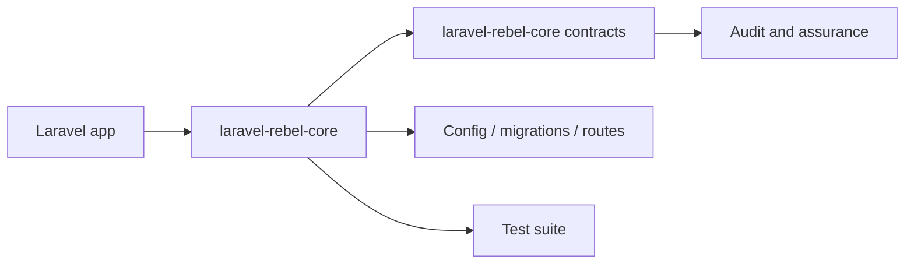

# laravel-rebel-core

[GitHub repository](https://github.com/padosoft/laravel-rebel-core) · Composer package: `padosoft/laravel-rebel-core`

## Motivazione

Core primitives, value objects and contracts for Laravel Rebel: the enterprise authentication control plane (AAL/AMR assurance, security context, audit, Sanctum tokens, rate-limiting). The entry point of the padosoft/laravel-rebel-* ecosystem.

This package participates in the Laravel Rebel ecosystem by contributing one bounded capability to the authentication control plane.

## Teoria

A Rebel package should expose a capability $C$ without redefining the global assurance model $A$. Formally, the package contributes evidence $e$ and configuration $k$:

$$
C(package)=f(e,k) \quad \text{while} \quad A \in core
$$

## Design + diagramma



## Modello dati / contratto

### Runtime files

- `src\Assurance\Aal.php`
- `src\Assurance\AssuranceLevel.php`
- `src\Audit\AuditEvent.php`
- `src\Audit\AuthEventType.php`
- `src\Audit\ContextEnrichingAuditLogger.php`
- `src\Audit\DatabaseAuditLogger.php`
- `src\Audit\QueuedAuditLogger.php`
- `src\Audit\RecordAuditEventJob.php`
- `src\Auth\LoginResult.php`
- `src\Auth\TokenPair.php`
- `src\Clock\FakeClock.php`
- `src\Clock\SystemClock.php`
- `src\Concerns\BelongsToTenant.php`
- `src\Config\CoreConfigValidator.php`
- `src\Console\ValidateConfigCommand.php`
- `src\Context\DeviceContext.php`
- `src\Context\SecurityContext.php`
- `src\Context\TenantContext.php`
- `src\Contracts\AuditLogger.php`
- `src\Contracts\BotProtection.php`
- `src\Contracts\ConfigValidator.php`
- `src\Contracts\DeviceTrust.php`
- `src\Contracts\KeyedHasher.php`
- `src\Contracts\RateLimiter.php`
- `src\Contracts\RiskEvaluator.php`
- `src\Contracts\SessionRegistry.php`
- `src\Contracts\SubjectResolver.php`
- `src\Contracts\TenantResolver.php`
- `src\Contracts\TokenIssuer.php`
- `src\Hashing\HashedValue.php`
- `src\Hashing\HmacKeyedHasher.php`
- `src\Identifiers\AuthIdentifier.php`
- `src\Identifiers\EmailIdentifier.php`
- `src\Identifiers\GenericIdentifier.php`
- `src\Identifiers\PhoneIdentifier.php`

### Service providers

- `src\RebelCoreServiceProvider.php`

### Services and managers

- `src\Contracts\SessionRegistry.php`
- `src\Contracts\SubjectResolver.php`
- `src\Contracts\TenantResolver.php`
- `src\RebelCoreServiceProvider.php`

### Contracts

- `src\Contracts\AuditLogger.php`
- `src\Contracts\BotProtection.php`
- `src\Contracts\ConfigValidator.php`
- `src\Contracts\DeviceTrust.php`
- `src\Contracts\KeyedHasher.php`
- `src\Contracts\RateLimiter.php`
- `src\Contracts\RiskEvaluator.php`
- `src\Contracts\SessionRegistry.php`
- `src\Contracts\SubjectResolver.php`
- `src\Contracts\TenantResolver.php`
- `src\Contracts\TokenIssuer.php`

### Controllers

None detected in the package tree.

### Middleware

None detected in the package tree.

### Models

- `src\Models\RebelAuthEvent.php`

### Config

- `config\rebel-core.php`

### Migrations

- `database\migrations\create_rebel_auth_events_table.php`

### Routes

None detected in the package tree.

### Commands

- `src\Console\ValidateConfigCommand.php`

## Composer requirements

| Dependency | Constraint |
|---|---|
| `illuminate/contracts` | `^12.0|^13.0` |
| `illuminate/support` | `^12.0|^13.0` |
| `php` | `^8.3` |
| `psr/clock` | `^1.0` |
| `spatie/laravel-package-tools` | `^1.92` |

## Development requirements

| Dependency | Constraint |
|---|---|
| `larastan/larastan` | `^3.0` |
| `laravel/pint` | `^1.18` |
| `orchestra/testbench` | `^10.0|^11.0` |
| `pestphp/pest` | `^4.0` |
| `pestphp/pest-plugin-laravel` | `^4.0` |

## ADR

::: collapsible "Problem: keep laravel-rebel-core replaceable"
Decision: document its public responsibility and use Rebel core contracts at integration boundaries.

Consequences: applications can adopt the package without coupling every other Rebel module to its internals.
:::

::: collapsible "Problem: package-specific behavior must remain auditable"
Decision: all security-significant outcomes should emit or feed audit events through the core vocabulary.

Consequences: admin API, admin UI and AI guard can reason across packages without bespoke parsers for every provider.
:::

## Worked example

```bash
composer require padosoft/laravel-rebel-core
php artisan vendor:publish
php artisan migrate
```

## Test and verification surface

- `tests\Feature\AuditDispatchTest.php`
- `tests\Feature\BelongsToTenantTest.php`
- `tests\Feature\DatabaseAuditLoggerTest.php`
- `tests\Feature\RebelAuthEventModelTest.php`
- `tests\Feature\ValidateConfigCommandTest.php`
- `tests\Unit\Assurance\AssuranceLevelTest.php`
- `tests\Unit\Audit\AuditEventTest.php`
- `tests\Unit\Auth\LoginResultTest.php`
- `tests\Unit\Clock\FakeClockTest.php`
- `tests\Unit\Context\SecurityContextTest.php`
- `tests\Unit\Context\TenantContextTest.php`
- `tests\Unit\Hashing\HmacKeyedHasherTest.php`
- `tests\Unit\Identifiers\EmailIdentifierTest.php`
- `tests\Unit\Identifiers\GenericIdentifierTest.php`
- `tests\Unit\Identifiers\PhoneIdentifierTest.php`
- `tests\Unit\Risk\RiskAssessmentTest.php`
- `tests\Unit\Support\RedactorTest.php`
- `tests\Unit\SkeletonTest.php`
- `tests\Pest.php`
- `tests\TestCase.php`

::: callout warning
Do not copy internal test-only classes into an application. Treat file lists as a source map for maintainers and auditors, not as an installation recipe by themselves.
:::
