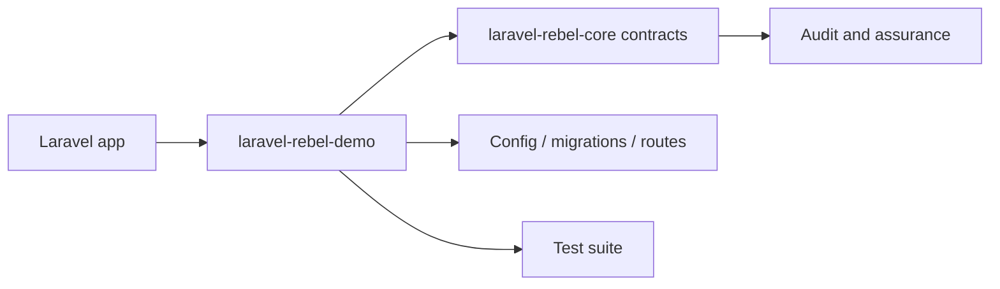

# laravel-rebel-demo

[GitHub repository](https://github.com/padosoft/laravel-rebel-demo) · Composer package: `padosoft/laravel-rebel-demo`

## Motivazione

Demo / integration application for the padosoft/laravel-rebel-* enterprise authentication suite.

This package participates in the Laravel Rebel ecosystem by contributing one bounded capability to the authentication control plane.

## Teoria

A Rebel package should expose a capability $C$ without redefining the global assurance model $A$. Formally, the package contributes evidence $e$ and configuration $k$:

$$
C(package)=f(e,k) \quad \text{while} \quad A \in core
$$

## Design + diagramma



## Modello dati / contratto

### Runtime files

None detected in the package tree.

### Service providers

None detected in the package tree.

### Services and managers

None detected in the package tree.

### Contracts

None detected in the package tree.

### Controllers

None detected in the package tree.

### Middleware

None detected in the package tree.

### Models

None detected in the package tree.

### Config

- `config\app.php`
- `config\auth.php`
- `config\cache.php`
- `config\database.php`
- `config\filesystems.php`
- `config\logging.php`
- `config\mail.php`
- `config\one-time-passwords.php`
- `config\otpz.php`
- `config\passkeys.php`
- `config\queue.php`
- `config\rebel-admin-api.php`
- `config\rebel-admin.php`
- `config\rebel-ai-guard.php`
- `config\rebel-bot-protection.php`
- `config\rebel-bridge-laragear-2fa.php`
- `config\rebel-bridge-otpz.php`
- `config\rebel-bridge-passkeys.php`
- `config\rebel-bridge-spatie-otp.php`
- `config\rebel-channel-twilio.php`
- `config\rebel-channels.php`
- `config\rebel-core.php`
- `config\rebel-email-otp.php`
- `config\rebel-recovery.php`
- `config\rebel-sessions.php`
- `config\rebel-step-up.php`
- `config\services.php`
- `config\session.php`
- `config\two-factor.php`

### Migrations

- `database\factories\UserFactory.php`
- `database\migrations\0001_01_01_000000_create_users_table.php`
- `database\migrations\0001_01_01_000001_create_cache_table.php`
- `database\migrations\0001_01_01_000002_create_jobs_table.php`
- `database\migrations\2026_06_03_123812_create_rebel_auth_events_table.php`
- `database\migrations\2026_06_03_123835_create_rebel_email_otp_challenges_table.php`
- `database\migrations\2026_06_03_123836_create_rebel_step_up_challenges_table.php`
- `database\migrations\2026_06_03_123837_create_rebel_metric_buckets_table.php`
- `database\migrations\2026_06_03_123838_create_rebel_sessions_table.php`
- `database\migrations\2026_06_03_123839_create_rebel_devices_table.php`
- `database\migrations\2026_06_03_123839_create_rebel_recovery_codes_table.php`
- `database\migrations\2026_06_03_123840_create_rebel_anomaly_cases_table.php`
- `database\migrations\2026_06_03_130000_add_is_admin_to_users_table.php`
- `database\migrations\2026_06_03_154527_create_rebel_risk_rules_table.php`
- `database\migrations\2026_06_03_154528_create_rebel_admin_settings_table.php`
- `database\migrations\2026_06_04_032639_create_passkeys_table.php`
- `database\migrations\2026_06_04_032711_create_one_time_passwords_table.php`
- `database\migrations\2026_06_04_032742_create_two_factor_authentications_table.php`
- `database\migrations\2026_06_04_032808_create_otps_table.php`
- `database\seeders\DatabaseSeeder.php`

### Routes

- `routes\console.php`
- `routes\web.php`

### Commands

None detected in the package tree.

## Composer requirements

| Dependency | Constraint |
|---|---|
| `benbjurstrom/otpz` | `0.7` |
| `laragear/two-factor` | `4.0` |
| `laravel/fortify` | `^1.25` |
| `laravel/framework` | `^13.8` |
| `laravel/sanctum` | `^4.0` |
| `laravel/tinker` | `^3.0` |
| `padosoft/laravel-rebel-admin-api` | `0.1.7` |
| `padosoft/laravel-rebel-auth` | `^0.1` |
| `padosoft/laravel-rebel-bot-protection` | `0.1` |
| `padosoft/laravel-rebel-bridge-laragear-2fa` | `0.1.1` |
| `padosoft/laravel-rebel-bridge-otpz` | `0.1` |
| `padosoft/laravel-rebel-bridge-passkeys` | `0.1` |
| `padosoft/laravel-rebel-bridge-spatie-otp` | `0.1` |
| `padosoft/laravel-rebel-channel-bird` | `0.1` |
| `padosoft/laravel-rebel-channel-discord` | `0.1` |
| `padosoft/laravel-rebel-channel-telegram` | `0.1` |
| `padosoft/laravel-rebel-channel-twilio` | `^0.1` |
| `padosoft/laravel-rebel-channel-vonage` | `0.1` |
| `padosoft/laravel-rebel-channels` | `0.1.2` |
| `php` | `^8.3` |
| `spatie/laravel-one-time-passwords` | `1.1` |
| `spatie/laravel-passkeys` | `1.8` |

## Development requirements

| Dependency | Constraint |
|---|---|
| `fakerphp/faker` | `^1.23` |
| `laravel/pail` | `^1.2.5` |
| `laravel/pao` | `^1.0.6` |
| `laravel/pint` | `^1.27` |
| `mockery/mockery` | `^1.6` |
| `nunomaduro/collision` | `^8.6` |
| `phpunit/phpunit` | `^12.5.12` |

## ADR

::: collapsible "Problem: keep laravel-rebel-demo replaceable"
Decision: document its public responsibility and use Rebel core contracts at integration boundaries.

Consequences: applications can adopt the package without coupling every other Rebel module to its internals.
:::

::: collapsible "Problem: package-specific behavior must remain auditable"
Decision: all security-significant outcomes should emit or feed audit events through the core vocabulary.

Consequences: admin API, admin UI and AI guard can reason across packages without bespoke parsers for every provider.
:::

## Worked example

```bash
composer require padosoft/laravel-rebel-demo
php artisan vendor:publish
php artisan migrate
```

## Test and verification surface

- `tests\Feature\ExampleTest.php`
- `tests\Feature\ExtrasIntegrationTest.php`
- `tests\Unit\ExampleTest.php`
- `tests\TestCase.php`

::: callout warning
Do not copy internal test-only classes into an application. Treat file lists as a source map for maintainers and auditors, not as an installation recipe by themselves.
:::
