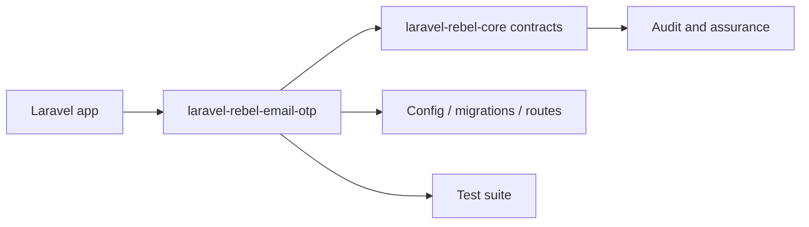

# laravel-rebel-email-otp

[GitHub repository](https://github.com/padosoft/laravel-rebel-email-otp) · Composer package: `padosoft/laravel-rebel-email-otp`

## Motivazione

Enterprise passwordless email-OTP login for Laravel Rebel: anti-enumeration, multi-dimensional rate-limiting, multi-tenant/purpose/risk, Sanctum token issuance. Part of padosoft/laravel-rebel-*.

This package participates in the Laravel Rebel ecosystem by contributing one bounded capability to the authentication control plane.

## Teoria

A Rebel package should expose a capability $C$ without redefining the global assurance model $A$. Formally, the package contributes evidence $e$ and configuration $k$:

$$
C(package)=f(e,k) \quad \text{while} \quad A \in core
$$

## Design + diagramma



## Modello dati / contratto

### Runtime files

- `src\Actions\ResendEmailOtpChallenge.php`
- `src\Actions\StartEmailOtpChallenge.php`
- `src\Actions\VerifyEmailOtpChallenge.php`
- `src\Console\PruneChallengesCommand.php`
- `src\Enums\ChallengeStatus.php`
- `src\Http\Controllers\EmailOtpController.php`
- `src\Models\EmailOtpChallenge.php`
- `src\Notifications\EmailOtpNotification.php`
- `src\Otp\NumericOtpGenerator.php`
- `src\Otp\OtpHasher.php`
- `src\Resolvers\NullSubjectResolver.php`
- `src\Results\StartEmailOtpResult.php`
- `src\Results\VerifyEmailOtpResult.php`
- `src\RebelEmailOtp.php`
- `src\RebelEmailOtpServiceProvider.php`

### Service providers

- `src\RebelEmailOtpServiceProvider.php`

### Services and managers

- `src\Resolvers\NullSubjectResolver.php`
- `src\RebelEmailOtpServiceProvider.php`

### Contracts

None detected in the package tree.

### Controllers

- `src\Http\Controllers\EmailOtpController.php`

### Middleware

None detected in the package tree.

### Models

- `src\Models\EmailOtpChallenge.php`

### Config

- `config\rebel-email-otp.php`

### Migrations

- `database\migrations\create_rebel_email_otp_challenges_table.php`

### Routes

- `routes\web.php`

### Commands

- `src\Console\PruneChallengesCommand.php`

## Composer requirements

| Dependency | Constraint |
|---|---|
| `illuminate/contracts` | `^12.0|^13.0` |
| `illuminate/support` | `^12.0|^13.0` |
| `padosoft/laravel-rebel-core` | `^0.1` |
| `php` | `^8.3` |
| `spatie/laravel-package-tools` | `^1.92` |

## Development requirements

| Dependency | Constraint |
|---|---|
| `larastan/larastan` | `^3.0` |
| `laravel/pint` | `^1.18` |
| `orchestra/testbench` | `^10.0|^11.0` |
| `pestphp/pest` | `^4.0` |
| `pestphp/pest-plugin-laravel` | `^4.0` |

## ADR

::: collapsible "Problem: keep laravel-rebel-email-otp replaceable"
Decision: document its public responsibility and use Rebel core contracts at integration boundaries.

Consequences: applications can adopt the package without coupling every other Rebel module to its internals.
:::

::: collapsible "Problem: package-specific behavior must remain auditable"
Decision: all security-significant outcomes should emit or feed audit events through the core vocabulary.

Consequences: admin API, admin UI and AI guard can reason across packages without bespoke parsers for every provider.
:::

## Worked example

```bash
composer require padosoft/laravel-rebel-email-otp
php artisan vendor:publish
php artisan migrate
```

## Test and verification surface

- `tests\Feature\EmailOtpFlowTest.php`
- `tests\Feature\EmailOtpResendTest.php`
- `tests\Feature\EmailOtpSubjectTest.php`
- `tests\Feature\EmailOtpTenantTest.php`
- `tests\Feature\EmailOtpWebFlowTest.php`
- `tests\Feature\MigrationTest.php`
- `tests\Feature\PruneChallengesTest.php`
- `tests\Unit\NumericOtpGeneratorTest.php`
- `tests\Unit\SkeletonTest.php`
- `tests\Pest.php`
- `tests\TestCase.php`

::: callout warning
Do not copy internal test-only classes into an application. Treat file lists as a source map for maintainers and auditors, not as an installation recipe by themselves.
:::
