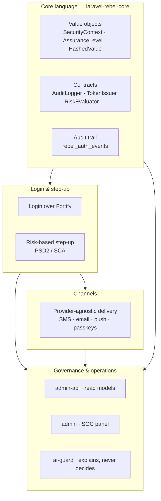

# Architecture Overview

> Laravel Rebel is an **enterprise authentication control plane** built on top of Laravel Fortify.
> It is not a single package but **22 composable packages** organized as layers, with one rule that
> shapes everything: the shared *language* lives at the bottom and never depends on anything, while
> the volatile, fast-moving integrations live at the leaves where they can change without rippling
> through the system.

## The mental model: a control plane in layers

Think of Rebel less as "an auth library" and more as a **control plane**: a set of cooperating
layers that each own a narrow responsibility and talk to each other through typed value objects and
contracts rather than through shared mutable state.

::: callout info
The foundation is **[`laravel-rebel-core`](/packages/core)**. It defines the value objects, the NIST
assurance model, keyed hashing, the redacting audit trail and the contracts. It has **no hard
dependency** on Fortify, Twilio, a passkey library or any AI provider — so it stays small and stable
while everything above it moves.
:::

| Layer | Owns | Examples |
|---|---|---|
| **Core language** | The shared vocabulary every package speaks. | Value objects, assurance model, keyed hashing, audit, contracts. |
| **Login & step-up** | Turning a request into a decision; per-action re-authentication. | Fortify-backed login, risk-based step-up, PSD2/SCA dynamic linking. |
| **Channels** | Delivering challenges through providers, with fallback and anti-fraud. | SMS/email/push providers, passkeys. Delivery is **not** authentication. |
| **Governance & operations** | Reading the system: dashboards, anomalies, explanations. | `admin-api` read models → `admin` SOC panel; `ai-guard` advisory only. |

## Why the core depends on nothing

The single most important architectural choice is **inversion of volatility**. The things most likely
to change — an SMS provider's API, a WebAuthn library, an AI model — are the things kept **furthest
from the core**. The core only knows about *contracts*; the concrete, churn-prone implementations
plug in at the edges.

::: callout tip
**Blast radius.** When Twilio changes an endpoint or a passkey library ships a breaking release, the
change is contained in a leaf package. Application policy — "this action needs AAL2,
phishing-resistant" — is expressed against the core and does not move.
:::

This is what makes the suite **modular**: you install only the leaves you need, and they all share the
same auditable language underneath. See how the packages depend on each other in the
**[dependency graph](/ecosystem/dependency-graph)**.

## Contracts are the seams

Every boundary between layers is a **contract** (a PHP interface) bound in the container. Each contract
ships a sane default and is meant to be **swapped per application**:

| Contract | The seam it owns |
|---|---|
| `AuditLogger` | Where security events go (DB by default; swap for a SIEM or data lake). |
| `RiskEvaluator` | How a request's risk is scored. |
| `TokenIssuer` | How Sanctum access + refresh `TokenPair`s are minted. |
| `SubjectResolver` / `TenantResolver` | Who the actor is, and which tenant they belong to. |
| `SessionRegistry` · `DeviceTrust` · `BotProtection` · `RateLimiter` | The defensive perimeter. |
| `KeyedHasher` | The PII keying/peppering strategy. |
| `Clock` (PSR-20) | Deterministic time, for testability. |

Because these are interfaces, an enterprise can rebind any one of them without forking a package — the
rest of the control plane keeps working against the same types. The full catalogue lives in
**[Data Model & Contracts](/architecture/data-model-contract)**.

## From request to decision

The layers above describe *what exists*; the **[Pipeline & Workflow](/architecture/pipeline-workflow)**
page describes *what happens on every request*: build a `SecurityContext`, evaluate risk, check
assurance against the action's requirement, decide Allow / Step-up / Deny, and record an `AuditEvent`.
Read that next.

::: callout warning
Rebel standardizes on **NIST 800-63B-4** assurance, **PSD2/SCA** for sensitive operations and **GDPR**
for data handling. These are not afterthoughts bolted on top — they are encoded in the core's types,
which is why every layer above inherits them for free.
:::
