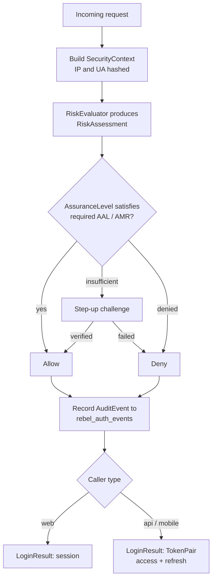

# Pipeline & Workflow

> Where the [overview](/architecture/overview) describes *what exists*, this page describes *what
> happens on every protected request*. A request enters; a **decision** comes out; and an immutable
> **audit event** is always written. The flow is the same whether the caller is a web session or a
> mobile client asking for tokens — only the final result type differs.

## The pipeline at a glance

## Step by step

::: steps

1. **Build the `SecurityContext`.**
   The request is reduced to a typed, **privacy-safe** context. The IP address and User-Agent are
   never stored in cleartext — they enter as **keyed HMACs** (`HashedValue` carrying a `keyVersion`).
   Country is derived from the `CF-IPCountry` header. This context is the single input every later
   stage reads from.

2. **Evaluate risk.**
   The `RiskEvaluator` contract turns the context into a `RiskAssessment` (a level plus a recommended
   action). The default implementation ships sane heuristics; an enterprise rebinds it to plug in its
   own signals — velocity, device reputation, geo-impossibility — without touching the rest of the
   flow.

3. **Check assurance.**
   Every protected action declares a **required** assurance: a minimum NIST AAL and, optionally, that
   the method be phishing-resistant. The actor's current `AssuranceLevel` is asked
   `satisfies(Aal, requirePhishingResistant)`. An email-OTP session (AAL1) does **not** satisfy an
   action that requires AAL2 phishing-resistant — only a passkey would.

4. **Decide: Allow / Step-up / Deny.**
   Combining risk and assurance yields one of three outcomes:

   | Outcome | When | What happens next |
   |---|---|---|
   | **Allow** | Assurance satisfies the requirement and risk is within threshold. | The action proceeds. |
   | **Step-up** | Assurance is insufficient, or risk pushes the bar up. | A per-action challenge is issued; on success the flow re-enters at *Allow*. |
   | **Deny** | Risk is too high, or step-up failed. | The action is refused — fail-closed. |

5. **Record the `AuditEvent` — always.**
   Whatever the outcome, an `AuditEvent` is written through the `AuditLogger` contract to
   **`rebel_auth_events`** (never to the session). The `Redactor` strips secrets first, so OTPs,
   tokens and raw challenges never reach the database. Dispatch is **configurable sync or queue**
   (`audit.mode`), so high-traffic deployments can push writes onto Horizon via `RecordAuditEventJob`.

6. **Return a `LoginResult`.**
   For a successful login the pipeline produces a `LoginResult`: a **web session** for browser
   callers, or a Sanctum **`TokenPair`** (access + refresh) for API and mobile callers. The decision
   logic above is identical; only this final envelope changes.

:::

## Step-up is per-action, not per-session

A crucial property: assurance is checked **against the action**, not banked once at login. A user can
browse with an AAL1 session and still be challenged the instant they attempt something sensitive.

::: callout info
**PSD2 / SCA dynamic linking.** For regulated payment actions the step-up challenge is bound to the
**amount and payee** — the value the user confirms is cryptographically tied to the value being
executed, so a man-in-the-middle cannot swap the destination after approval.
:::

## Delivery is not authentication

When a step-up challenge goes out over a channel (SMS, email, push), the **delivery receipt** and the
**authentication result** are two different facts. A delivered OTP proves the message left the
provider; it does **not** prove the user. The pipeline only advances to *Allow* on a verified
challenge response, and both the send and the verification are recorded as distinct events.

::: callout warning
Never treat a successful provider send as a successful authentication, and never log the OTP, the
recovery secret, the raw passkey challenge or a provider token. The `Redactor` enforces this for
audit metadata, but the same discipline applies anywhere in your own code.
:::

## Where to go next

- The shapes that flow through this pipeline — `SecurityContext`, `RiskAssessment`, `AssuranceLevel`,
  `LoginResult`, `TokenPair` — and the `rebel_auth_events` schema are detailed in
  **[Data Model & Contracts](/architecture/data-model-contract)**.
- The reasoning behind making assurance a first-class type, always persisting audit, and pushing
  volatility to the leaves is recorded in the **[Architecture Decision Records](/architecture/adr)**.
