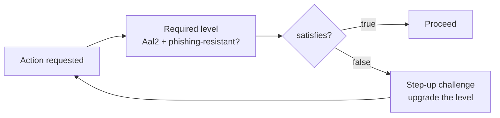

# Assurance Theory

> "Authenticated" is not a boolean. The strength of an authentication has a *level*, and that level — not the mere fact of a session — is what should gate a sensitive action.

Laravel Rebel models authentication strength on [NIST SP 800-63B-4](https://pages.nist.gov/800-63-4/). The core exposes it as a small, immutable value object so that policy is a type-checked comparison, not a pile of hand-written conditionals.

## Two axes: AAL and AMR

NIST separates *how strong* an authentication is from *which methods* produced it.

**AAL — Authenticator Assurance Level** is the strength tier:

| AAL | Meaning | Typical factors |
|---|---|---|
| **AAL1** | Single-factor; some assurance the user controls an authenticator. | email-OTP, password |
| **AAL2** | Two distinct factors; proof of possession + control. | TOTP, SMS-OTP, passkey |
| **AAL3** | Hardware-backed, **verifier-impersonation (phishing) resistant**, cryptographic proof. | passkey on a hardware authenticator |

**AMR — Authentication Methods References** is the *array of methods actually used* (`['otp', 'email']`, `['webauthn']`, `['totp']`). AAL is the conclusion; AMR is the evidence. The audit trail records the AMR so an auditor can see *why* an event was assigned its AAL — not just the tier.

## Why only passkeys are phishing-resistant

A factor is **phishing-resistant** when a relying-party impersonator cannot replay or relay the proof. Passkeys (WebAuthn/FIDO2) bind the ceremony to the *origin*: the authenticator signs a challenge scoped to the real domain, so a credential captured on a look-alike site is useless. This is the only factor in the model that earns the `phishingResistant: true` flag, and it is what lets a passkey reach AAL2/AAL3.

By contrast, an email-OTP or a TOTP code is a *shared bearer secret in transit*: if a user is tricked into typing it into a phishing page, the attacker forwards it in real time. The codes can satisfy a possession requirement, but never a phishing-resistant one.

::: callout warning
**SMS is "restricted" under NIST 800-63B-4.** SMS-OTP can reach AAL2, but the standard flags the channel as restricted because of SIM-swap, SS7 interception and number-porting risk. Treat it as a fallback, surface its cost and country in the [audit trail](/concepts/security-invariants), and prefer passkeys for high-risk actions. See [Step-up & SCA](/guides/step-up-sca).
:::

## Factor comparison

| Factor | AMR | AAL | Phishing-resistant |
|---|---|---|---|
| Password only | `['pwd']` | AAL1 | No |
| Email-OTP | `['otp','email']` | AAL1 | No |
| TOTP (authenticator app) | `['totp']` | AAL2 | No |
| SMS-OTP | `['otp','sms']` | AAL2 (restricted) | No |
| Passkey (WebAuthn/FIDO2) | `['webauthn']` | AAL2 / AAL3 | **Yes** |

## The `AssuranceLevel` value object

The model is immutable and `final`. It carries the tier, the phishing-resistance flag and the AMR, and exposes a single guard so policy never re-implements the comparison:

```php
use Padosoft\Rebel\Core\Assurance\Aal;
use Padosoft\Rebel\Core\Assurance\AssuranceLevel;

$emailOtp = new AssuranceLevel(Aal::Aal1, phishingResistant: false, amr: ['otp', 'email']);
$passkey  = new AssuranceLevel(Aal::Aal2, phishingResistant: true,  amr: ['webauthn']);

// Policy for a sensitive action: require AAL2 AND phishing resistance.
$emailOtp->satisfies(Aal::Aal2, requirePhishingResistant: true); // false ← AAL1, not phishing-resistant
$passkey->satisfies(Aal::Aal2, requirePhishingResistant: true);  // true
```

`satisfies()` enforces **both** conditions: the achieved tier must be at least the required one, **and** if the action demands phishing resistance the level must carry it. An AAL1 email-OTP can never satisfy a phishing-resistant requirement — there is no flag, parameter or escape hatch that lets it.

::: callout tip
Express the *requirement* once, at the action boundary, and let `satisfies()` decide. Scattering `if ($aal === ...)` checks through controllers is exactly the ad-hoc comparison this value object exists to replace — see [Security Invariants](/concepts/security-invariants).
:::

## How it drives behaviour



When `satisfies()` returns `false`, the suite issues a step-up challenge to *raise* the user's assurance to what the action needs, rather than denying outright. That escalation is also influenced by the [risk model](/concepts/risk-model): risk can demand a *higher* bar than the action's baseline.
