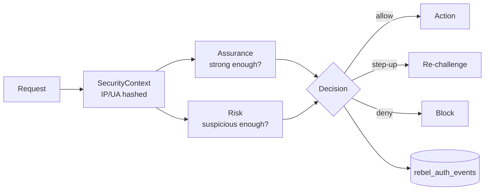

# Motivation

> Laravel Fortify answers "is this user logged in?". An enterprise, ecommerce or fintech product has to answer a harder question: "is this user authenticated *strongly enough*, from a *trustworthy enough* context, to perform *this specific action* — and can I prove it later?"

Laravel Rebel exists to close that gap without forcing you to fork Fortify or reinvent an auth platform per project. It is an enterprise authentication control plane: 22 composable packages over Fortify, with [`laravel-rebel-core`](/packages/core) defining the shared *language* everything else speaks.

## The gap above Fortify

Fortify gives you the mechanics of authentication — login, registration, password reset, two-factor scaffolding — as headless backend logic. That is an excellent foundation, but it deliberately stops at the boundary of a single concern: credentials. It does not have an opinion about any of the things a regulated product lives or dies on:

| What the product needs | What plain Fortify gives you |
|---|---|
| "Is AAL2 phishing-resistant enough for *this* payout change?" | A boolean: authenticated or not. |
| A tamper-evident trail of every security decision | Whatever you log by hand. |
| No cleartext PII (IP, email, user-agent) at rest | Cleartext, unless you build hashing yourself. |
| Per-action step-up bound to an amount and payee (PSD2/SCA) | Out of scope. |
| Risk signals driving allow / step-up / deny | Out of scope. |

Every team that hits this gap ends up building the same substrate — assurance levels, an audit table, keyed hashing, a risk hook — slightly differently, slightly wrong, and impossible to audit across services. Rebel makes that substrate a first-class, shared, tested dependency.

## A shared language, not a monolith

The decisive design choice is that the *vocabulary* is centralized and the *features* are not. `laravel-rebel-core` is small, stable and slow-changing. It defines:

- a typed **assurance model** (NIST [AAL/AMR](/concepts/assurance-theory)) with a guard that enforces it;
- **keyed hashing** so identifiers, IPs and user-agents are never stored in cleartext;
- a **redacting audit trail** that physically cannot leak OTPs or secrets;
- and a set of **contracts** you bind to your own infrastructure.

Because every other package — OTP, passkeys, channels, step-up, admin — speaks this same language, a delivery receipt from an SMS provider, a passkey ceremony and a payout confirmation all land in the *same* `rebel_auth_events` trail with the *same* assurance semantics. That end-to-end coherence is the whole point.

::: callout info
You rarely install `-core` on its own; it arrives as a dependency of the feature packages. But you can use it stand-alone for its value objects and contracts. See the [Package Map](/ecosystem/package-map) for how the 22 packages compose.
:::

## Why many small packages

Splitting the suite into narrow packages is not aesthetic — it is about **blast radius** and honest dependency boundaries.

::: grids
::: grid
::: card "Minimal blast radius" icon:shield
A CVE or breaking change in an SMS provider package touches only apps that send SMS. The assurance model, the audit trail and your payout policy are untouched.
:::
:::
::: grid
::: card "Install only what you run" icon:package
A passwordless ecommerce checkout pulls passkeys and OTP; it does not drag in LDAP, SAML or hardware-token code it will never execute.
:::
:::
::: grid
::: card "Stable core, fast edges" icon:git-branch
Provider packages can iterate quickly because they normalize their evidence through core contracts. Application policy depends on the stable core, not on a provider's quirks.
:::
:::
:::

## The decision Rebel is built around

Every Rebel-protected action ultimately resolves one question, and the core gives you the types to express it without ad-hoc `if` statements scattered across controllers:

[Assurance](/concepts/assurance-theory) answers *"strong enough?"*; the [risk model](/concepts/risk-model) answers *"suspicious enough?"*; the [security invariants](/concepts/security-invariants) keep both honest. For the competitive rationale — why this beats wiring it yourself or buying a closed IDaaS — read [Why Rebel](/ecosystem/why-rebel).
