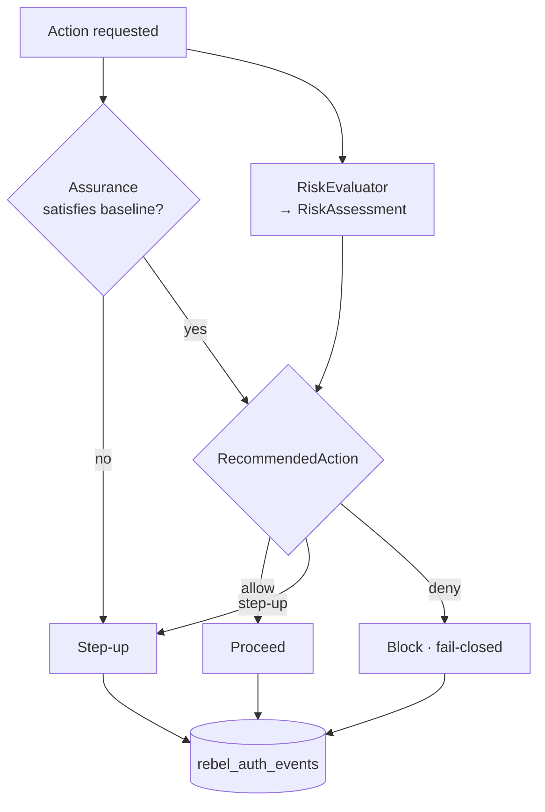

# Risk Model

> Assurance asks *"is this authentication strong enough?"* Risk asks *"is this attempt suspicious enough?"* A login can be perfectly strong and still be wrong — a valid passkey used from a brand-new device in a new country at 3am deserves a second look.

The two run side by side. [Assurance](/concepts/assurance-theory) sets a *floor* the action must clear; risk can *raise* that floor when the context smells off. Both feed one decision.

## The pieces

The core ships three value objects and one contract:

| Type | Role |
|---|---|
| `RiskAssessment` | The outcome of evaluating a request: its level, the signals that fired, and the recommended action. |
| `RiskLevel` | The graded conclusion — e.g. low / elevated / high. |
| `RecommendedAction` | What the policy should do next: **allow**, **step-up**, or **deny**. |
| `RiskEvaluator` (contract) | The pluggable engine that produces a `RiskAssessment` from a request context. |

`RiskEvaluator` is a [swappable contract](/packages/core): the suite ships a sensible default, but you bind your own in the container to plug a fraud engine, a device-reputation service, or an ML scorer — without changing a single line of the policy that consumes the result.

## Signals it weighs

A risk evaluator reads the [`SecurityContext`](/concepts/security-invariants) — where IP and user-agent are already keyed HMACs, never cleartext — and combines signals such as:

- **New device** — the device fingerprint has never been seen for this subject.
- **New IP / network** — first time from this hashed IP or ASN.
- **Geo-velocity** — two logins from countries too far apart to travel between in the elapsed time ("impossible travel"). Country comes from the [audit geo header](/concepts/security-invariants) (default `CF-IPCountry`).
- **Anomalous timing or rate** — bursts, off-hours, or rate-limit pressure.
- **Bot / automation signals** — surfaced via the `BotProtection` contract.

## Signal → recommended action

Risk is a graded decision, not a tripwire. A single weak signal nudges; stacked signals escalate.

| Signal pattern | Risk level | Recommended action |
|---|---|---|
| Known device, known IP, normal timing | Low | **Allow** |
| New IP but known device | Elevated | **Step-up** (re-challenge) |
| New device + new country | High | **Step-up**, prefer phishing-resistant |
| Impossible travel / geo-velocity breach | High | **Step-up** or **deny** per policy |
| Automation / bot signature on a sensitive action | High | **Deny**, fail-closed |

::: callout info
These mappings are policy, not gospel — they live in *your* `RiskEvaluator`. The core's job is to give every evaluator the same typed inputs and outputs so the rest of the suite reacts identically regardless of which engine you bind.
:::

## How risk and assurance combine

The action declares a baseline assurance requirement. The risk assessment can demand *more* — or block outright. The decision is the composition of both:

The mental model is two gates in series:

> **Allowed** when the assurance clears the action's floor **and** the risk assessment does not call for escalation or denial.

If either gate is unhappy, the safe default is to escalate (step-up) rather than wave the request through — and when in genuine doubt, to deny. That **fail-closed** posture is one of the suite's [security invariants](/concepts/security-invariants). When risk forces a step-up on a high-value action, the challenge can be bound to the transaction itself (amount + payee) via [PSD2/SCA dynamic linking](/guides/step-up-sca).

::: callout warning
A step-up driven by risk must result in a *higher* assurance, not a repeat of the same factor. Re-sending the same email-OTP after a high-risk signal does not raise assurance — escalate toward a phishing-resistant factor where the action warrants it.
:::

Every assessment and every resulting decision is written to the audit trail, so a reviewer can later reconstruct exactly which signals fired and why the request was allowed, escalated or blocked.
