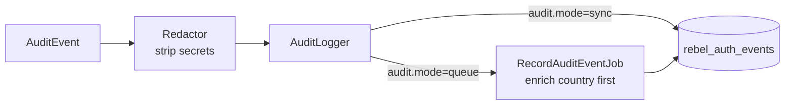

# Security Invariants

> An invariant is a property that holds *no matter what* — across every package, every provider, every code path. These are the rules Rebel will not let you break, because each one is the difference between a security control and a security theatre.

The suite is large and composable, but it is held together by a short list of properties that are true everywhere. If you are writing or reviewing a Rebel package, this is the checklist.

## The invariants

| # | Invariant | Why it matters | How it is enforced |
|---|---|---|---|
| 1 | **No cleartext PII at rest** | A leaked DB must not reveal who logged in from where. | Identifiers, IPs and user-agents are keyed HMACs (`HmacKeyedHasher` → `HashedValue`), stored as `hash_ip` / `hash_user_agent`. |
| 2 | **Keys rotate without breaking history** | Pepper compromise or routine rotation must not invalidate past records. | Versioned pepper (`peppers` = [version → secret], `pepper_current`); each hash carries its `keyVersion`; old hashes stay verifiable. |
| 3 | **Never log secrets** | A code or token in a log *is* a credential leak. | The `Redactor` replaces OTPs, recovery codes, tokens and webhook secrets with `[REDACTED]` before any audit write. |
| 4 | **Challenges are single-use and time-bounded** | A reusable or eternal challenge is a replayable bearer secret. | OTP, step-up and bridge packages consume a challenge exactly once and expire it; a verified challenge cannot be re-presented. |
| 5 | **Delivery ≠ authentication** | "SMS sent" or "email delivered" proves nothing about the user. | Delivery receipts are recorded as telemetry; only a verified challenge raises assurance. The two never share a code path. |
| 6 | **Fail-closed** | Ambiguity must resolve to *deny*, not *allow*. | On error, missing context or evaluator failure, the decision defaults to block/step-up — never silent allow. |
| 7 | **Assurance enforced by `satisfies()`** | Ad-hoc `if ($aal === ...)` checks drift and get it wrong. | Policy compares through `AssuranceLevel::satisfies()`; an AAL1 email-OTP cannot satisfy a phishing-resistant requirement. |
| 8 | **Audit always persisted** | A trail you can lose is not a trail. | Every security-significant outcome flows through the `AuditLogger` contract to `rebel_auth_events` — **never** session or flash storage. |

## No cleartext PII — keyed HMAC with rotation

Personal data that only needs to be *matched* (the same IP, the same identifier) is stored as an HMAC-SHA256 keyed with a **versioned pepper**, not as plaintext and not as a reversible cipher. `matches()` compares in constant time. Because each `HashedValue` records the `keyVersion` that produced it, you can introduce a new pepper (`REBEL_PEPPER_CURRENT`) and retire an old one (`REBEL_PEPPER_V1`) while every historical row remains verifiable. This is what makes the audit trail [GDPR-compatible](/ecosystem/why-rebel): no cleartext PII, redaction, and key rotation as a first-class operation.

## Never log secrets

::: callout warning
**Never write these to logs, exceptions, audit metadata or anywhere else in cleartext:** OTP codes, recovery/backup codes, raw passkey (WebAuthn) challenges, provider/access/refresh tokens, and webhook signing secrets. The `Redactor` sanitizes audit metadata to `[REDACTED]` automatically — do not route around it, and do not log these values through your own logger either.
:::

The audit logger is the *only* sanctioned sink for security-significant data, precisely because it passes through the `Redactor` before persistence:

```php
use Padosoft\Rebel\Core\Audit\AuditEvent;
use Padosoft\Rebel\Core\Contracts\AuditLogger;

app(AuditLogger::class)->record(new AuditEvent(
    type: 'email_otp.verified',
    guard: 'customers',
    purpose: 'customer-login',
    metadata: ['otp' => '123456'], // ← persisted as "[REDACTED]", never the code
));
```

## Delivery is not authentication

This invariant earns its own row because confusing the two is a classic, dangerous bug. When a channel reports that an SMS or email was *delivered*, that is a **telemetry** fact — useful for cost, country and deliverability dashboards. It says nothing about whether the right person received it. Assurance only rises when a *challenge is verified*. In Rebel the delivery receipt and the verification live on separate paths and produce separate event types, so a delivered-but-never-entered OTP can never be mistaken for a successful authentication.

## Audit always persisted, dispatched safely



Events are written through the `AuditLogger` contract to the `rebel_auth_events` table. Dispatch is configurable (`audit.mode` = `sync` | `queue`); the queued path uses `RecordAuditEventJob` (Horizon-ready) and enriches the event with country (from the `geo.country_header`, default `CF-IPCountry`) before write. Either way the destination is durable storage, never the session — a trail you cannot lose is the point.

::: callout tip
These invariants are the acceptance criteria for any new package. If a change weakens one of them, it is wrong by definition — fix the root cause rather than the symptom. See the [Motivation](/concepts/motivazione) for why the suite is built around them.
:::
