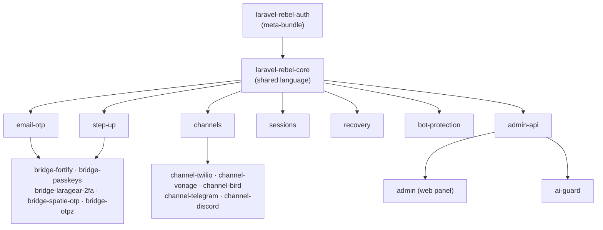

# Dependency Graph

Everything points back to `laravel-rebel-core`. The core depends on **nothing** in the suite (and
has no hard dependency on Fortify, Twilio or any AI provider). Volatile, third-party-facing
integrations — SMS providers, passkey libraries, AI — live at the **leaves**, so a change or outage
there can't ripple into the foundation.

---

## Recommended install order

::: steps
1. **Foundation** — `core` (and `auth` if you want the curated bundle in one shot).
2. **Login** — `email-otp`, then `bridge-fortify` to bring Fortify in.
3. **Step-up** — `step-up`, plus the bridges you need (`bridge-passkeys`, `bridge-laragear-2fa`, …).
4. **Channels** — `channels`, then one or more providers (`channel-twilio`, `channel-vonage`, `channel-bird`) and chat delivery (`channel-telegram`, `channel-discord`).
5. **Governance** — `sessions`, `recovery`, `bot-protection`.
6. **Operations** — `admin-api`, then `admin`; add `ai-guard` last (the admin works without it).
:::

> Using `laravel-rebel-auth`? It pulls in the recommended set for you — install it and skip the manual ordering.

---

## Design rule: keep volatility at the leaves

The shape of this graph is deliberate. A few invariants keep the **blast radius** of any change
small:

- **The core never depends on integrations.** It defines contracts; providers implement them. Swapping Twilio for Vonage touches one leaf, not the foundation.
- **The admin works without `ai-guard`.** Intelligence is additive, never a hard dependency of operations.
- **Provider packages are interchangeable.** They sit behind the `channels` abstraction, so call sites don't change when you add or remove one.
- **`fortify_password_confirm` is web-only.** Mobile uses a token-native step-up, so the bridge never forces a web-only assumption upstream.

In short: the packages most likely to change (third-party SMS, passkey libs, AI) are the ones with
the **fewest things depending on them**. That's what lets the suite evolve without breaking the apps
built on it.

::: callout tip
Want the role-based view instead of the dependency view? See the **[Package Map](/ecosystem/package-map)**.
Mapping a capability to a package? See the **[Capability Matrix](/ecosystem/capability-matrix)**.
:::
