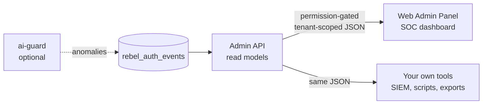

# Admin Operations

> Authentication is not done when login works. It is done when someone can *watch* it work — see
> the OTP funnel, spot the provider that started failing at 3am, and answer "who stepped up to
> approve that payout?" without grepping logs. That is what Admin Operations is for.

Laravel Rebel ships two cooperating packages for running the suite in production:

- **`laravel-rebel-admin-api`** — a headless JSON control plane. It exposes read models over the
  data that `-core` already records in `rebel_auth_events`: security metrics, an audit-event
  explorer, OTP and step-up funnels, and provider health.
- **`laravel-rebel-admin`** — a web Admin Panel (a security operations / SOC dashboard) built on
  Blade + AJAX + vanilla JavaScript, with no mandatory front-end framework. It consumes the Admin
  API and renders it for humans.

::: callout info
The web panel works **without `ai-guard`**. Anomaly detection is an optional layer — if you install
it, anomalies surface in the panel; if you don't, every other view still works. See
[AI Guard](/guides/ai-guard).
:::


---

## The two layers



The Admin API is the single source of truth. The web panel is *one* consumer of it; your own
incident tooling can be another. Everything both of them show traces back to events the core audit
trail recorded — there is no separate, divergent operations database.

---

## What the SOC dashboard gives you

::: grids
::: grid
::: card "Overview KPIs" icon:gauge
Logins, OTP verifications, step-up approvals, failures and active sessions at a glance, over a time
window. The honest empty state shows zero, never invented data.
:::
:::
::: grid
::: card "Audit explorer" icon:search
Browse and filter `rebel_auth_events`: by event type, guard, purpose, assurance level, tenant and
time. Identifiers stay keyed HMACs — you investigate without reading PII in cleartext.
:::
:::
::: grid
::: card "OTP & step-up funnels" icon:filter
Where do users drop? Challenge issued → delivered → verified for OTP; requested → satisfied for
step-up. Drop-off is where fraud and friction both hide.
:::
:::
::: grid
::: card "Provider health" icon:activity
Send success, delivery receipts, cost and country per channel provider. A provider degrading is an
operational event, not a mystery in a log file.
:::
:::
:::

---

## Permission-gating and tenant scoping

Both layers are read-only over security data, but "read-only" is not "open."

::: steps

1. **Panel access is gated.** The web panel sits behind the `EnsurePanelAccess` middleware. A user
   who can authenticate to your app is not automatically allowed into the SOC dashboard — panel
   access is a separate authorization decision.

2. **API endpoints are permission-gated.** Every Admin API read model checks the caller's
   permissions. Metrics, the audit explorer and provider health are distinct capabilities, so you
   can hand an analyst the explorer without handing them everything.

3. **Reads are tenant-scoped.** In a multi-tenant deployment, an operator sees their tenant's events
   and metrics — not the whole table. The read models build on the core `TenantContext` /
   `CurrentTenant` so scoping is enforced at the query layer, not patched on in the view.

:::

::: callout warning
Cross-tenant visibility is a deliberate, privileged capability — not a default. If you need a
platform-wide view for support, that is an explicit elevated permission, and the access itself is a
security-significant event worth auditing. Do not widen the default scope to "see everything."
:::

---

## The `rebel:project-metrics` command

For dashboards you don't sit in front of — CI gates, nightly reports, a status page feed — the
Admin API ships a real Artisan command:

```bash
php artisan rebel:project-metrics
```

It produces the same overview metrics the panel renders, from the command line. Wire it into a
scheduled job to push a daily security digest, or run it in a pipeline to assert that, say, the OTP
verification rate has not collapsed since the last deploy.

::: callout tip
Because the command reads the same `rebel_auth_events` data through the same read models, its
numbers always agree with the web panel. There is no second pipeline to keep in sync.
:::

---

## A day in operations

::: steps

1. **Morning glance.** Open the dashboard, scan the overview KPIs against yesterday. A sudden dip in
   the OTP funnel's *delivered* step points at a channel provider, not at your app.

2. **Confirm with provider health.** The provider-health view shows one SMS provider's delivery
   receipts dropping in a single country. You fail traffic over to the fallback provider (see
   [Channels & Fallback](/packages/channels)).

3. **Investigate a flagged event.** The audit explorer surfaces a burst of failed step-up attempts
   for one purpose. You filter by purpose and tenant, read the (keyed, non-PII) trail, and decide
   whether it's an attack or a broken integration.

4. **Report.** A scheduled `rebel:project-metrics` run has already posted the night's numbers to
   your status channel. Nothing here is hand-collected, so nothing drifts.

:::

---

::: callout info
**Related**

- Package reference: [admin](/packages/admin) · [admin-api](/packages/admin-api)
- The optional anomaly layer: [AI Guard](/guides/ai-guard)
- Where the data comes from: [the core audit trail](/packages/core)
- See it end to end: [Worked Example](/guides/worked-example)
:::
