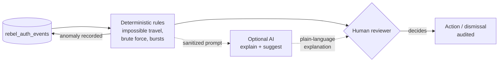

# AI Guard

> A copilot, not an autopilot. The rules decide what is anomalous; the AI never touches that
> decision. At most it explains an alert in plain language and *suggests* a next step — on a
> sanitized prompt, for a human who stays in the loop.

`laravel-rebel-ai-guard` is the optional anomaly layer of the suite. It does two clearly separated
jobs, and keeping them separate is the whole point:

- **Detection is deterministic.** Anomaly cases are found by explicit rules over the audit trail —
  impossible-travel, credential-stuffing bursts, OTP brute-force, sudden country changes. Same input,
  same verdict, every time. Auditable and testable.
- **The AI is advisory only.** When (and only when) you enable it, an LLM can *explain* a detected
  anomaly and *suggest* a response. It never decides, never escalates on its own, never takes a
  destructive action.

::: callout info
The [Web Admin Panel](/guides/admin-operations) works **without** AI Guard. Detection is optional;
the AI copilot inside it is optional again. Each layer you add is a deliberate choice, not a
dependency forced on you.
:::

---

## Two responsibilities, one boundary



The arrow that does **not** exist is AI → Action. The model's output flows only to a human. The
human's decision is what gets executed, and that decision is itself recorded through the core
`AuditLogger`.

---

## The sanitization guarantee

This is the non-negotiable rule: **the AI never sees secrets or PII.**

::: steps

1. **Rules run on real data.** Detection works over the audit trail, where identifiers are already
   keyed HMACs (no cleartext email, IP or phone) and OTPs were never stored in the first place — the
   core `Redactor` saw to that.

2. **Prompts are sanitized before they leave.** When an anomaly is sent to the AI to be explained,
   the prompt carries the *shape* of the event — type, counts, time window, geography signal — not
   the raw identity of anyone. No OTP, no secret, no PII crosses the boundary.

3. **A human reviews the output.** The AI's explanation and suggestion land in front of an operator,
   who accepts, edits or ignores them. The model is one more input to a human judgment, never the
   judgment itself.

:::

::: callout warning
If a rule can't run without raw PII, that's a bug in the rule, not a reason to relax sanitization.
Detection lives on the keyed/redacted audit trail by design. Never widen what reaches the AI to
"make the explanation better."
:::

---

## Running detection

AI Guard ships a real Artisan command that runs the deterministic pass:

```bash
php artisan rebel:detect-anomalies
```

Schedule it (every few minutes, or on a cadence that matches your risk tolerance) and it scans
recent `rebel_auth_events`, applies the rules, and records any anomalies back onto the audit trail —
where the [SOC dashboard](/guides/admin-operations) and provider-health views can surface them. The
AI copilot, if enabled, attaches explanations to those findings; if disabled, you still get every
deterministic anomaly.

::: callout tip
Treat detection as the source of truth and the AI as commentary. You can turn the copilot off
entirely and lose no detection coverage — only the plain-language summaries.
:::

---

## Why this split matters

::: grids
::: grid
::: card "Auditable" icon:scroll
A deterministic rule can be reviewed, version-controlled and explained to a regulator. "The model
felt it was risky" cannot.
:::
:::
::: grid
::: card "Safe by construction" icon:shield
Because the AI has no path to a destructive action, a hallucinated or adversarial response can waste
a reviewer's minute — it cannot lock out users or move money.
:::
:::
::: grid
::: card "Privacy-preserving" icon:lock
Sanitized prompts mean an LLM provider never receives identities or secrets, keeping the feature
compatible with strict data-handling requirements.
:::
:::
:::

---

::: callout info
**Related**

- Package reference: [ai-guard](/packages/ai-guard)
- Where anomalies are watched: [Admin Operations](/guides/admin-operations)
- The redacting audit trail anomalies are built on: [the core](/packages/core)
:::
