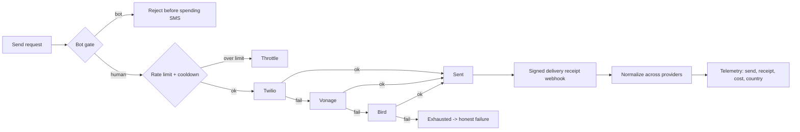

# Channels & Fallback

> By the end of this guide you'll send a verification message that survives a provider outage by failing over across providers, refuses to spend an SMS on a bot, resists toll-fraud, and reports honest delivery telemetry into the audit trail.

A verification code is only useful if it arrives. Tying your whole login flow to one SMS provider means one provider incident becomes your outage. `laravel-rebel-channels` is provider-agnostic SMS/WhatsApp/voice with automatic fallback, abuse controls, and normalized delivery receipts — so "did it actually get delivered?" becomes a fact you can audit, not a guess.

::: callout warning
A delivery result is **not** authentication success. "Delivered" means a carrier accepted the message — nothing more. The user is only authenticated when they return the code and it verifies.
:::

---

## The scenario

Your checkout sends a one-time code over SMS. Twilio has a regional hiccup. Instead of failing the user, the request fails over to Vonage, then Bird, with cooldown and rate limits in place, and a bot gate that stops automated traffic from burning your messaging budget. When the carrier confirms delivery, a signed webhook normalizes the receipt and the cost/country/status land in your telemetry.

## The fallback chain



The order matters: the **bot gate runs before any provider is touched**, so you never pay to message a bot, and abuse controls run before fallback so a failover storm can't bypass your limits.

## Walkthrough

::: steps

### Install the package and a provider

```bash
composer require padosoft/laravel-rebel-channels
composer require padosoft/laravel-rebel-channels-twilio
```

Add the providers you want in the fallback order — for example Twilio, Vonage and Bird.

### Publish and migrate

```bash
php artisan vendor:publish --tag="rebel-channels-config"
php artisan migrate
```

This wires the channel configuration and ensures `rebel_auth_events` exists for delivery telemetry.

### Validate configuration

```bash
php artisan rebel:validate-config
```

Run it in CI. It catches missing provider credentials, an empty fallback chain, or an unset webhook-signing secret before they cause a silent production failure.

### Order the fallback chain

Configure providers in priority order: **Twilio to Vonage to Bird**. If the first provider errors or times out, the next is tried. An exhausted chain returns an honest failure — surface it; don't pretend a send succeeded.

### Turn on the abuse controls

Enable the **bot gate** (it runs first, before any SMS is sent), **cooldown** (minimum interval between sends to the same number), and **multi-dimensional rate limiting**. Enable **anti toll-fraud/IRSF** protection so attackers can't drive traffic to premium-rate or international ranges to extract revenue at your expense.

### Receive and normalize delivery receipts

Point each provider's webhook at the package's receipt endpoint. Receipts are **signature-verified**, then **normalized** into one shape across Twilio, Vonage and Bird. The telemetry — sends, delivery receipts, cost, country — flows into the audit trail.

:::

## Telemetry that fills the admin panel

Every send and every receipt is recorded through the core audit trail: send attempt, which provider answered, delivery status, **cost**, and **country**. That's what powers the operations view — and it's why the fallback decision and the final receipt must both be captured, not just the initial attempt.

::: callout warning
Never log the OTP itself. The core `Redactor` strips secrets from audit metadata; phone numbers and identifiers are stored as keyed HMACs, never cleartext.
:::

## Gotchas

::: callout warning
Anti toll-fraud/IRSF is not optional for international flows. Without it, an attacker can request codes to attacker-controlled premium ranges and monetize your messaging spend. Keep it on, and keep country-level limits tight.
:::

::: callout tip
Verify webhook signatures on every receipt. An unsigned or spoofed receipt could mark a message "delivered" that never was — corrupting both your telemetry and any logic that keys off it.
:::

## Why this beats a single-provider integration

Most teams wire one SMS SDK directly and inherit that provider's outages, no normalized receipts, and no toll-fraud defense. Channels makes the provider an implementation detail behind fallback, cooldown, rate limiting and a bot gate, with one audited telemetry stream. See the full comparison in [Why Rebel](/ecosystem/why-rebel).

---

::: callout info
**Related**
- [laravel-rebel-channels](/packages/channels) — the package reference.
- [Twilio](/packages/channels-twilio), [Vonage](/packages/channels-vonage), [Bird](/packages/channels-bird) — provider drivers.
- [Why Rebel](/ecosystem/why-rebel) — how the resilient channel stack compares.
:::
