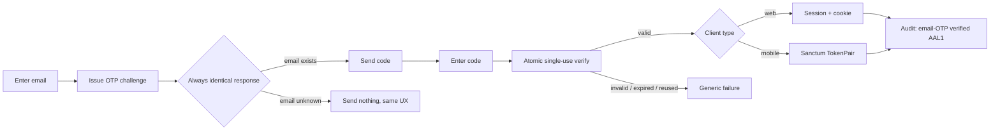

# Passwordless Login

> By the end of this guide you'll have a passwordless email-OTP login that works the same way for web and mobile, never leaks whether an email exists, and writes a clean AAL1 audit event on success.

Passwords are the weakest link most teams keep shipping. Email-OTP removes the stored secret entirely: the user proves control of their inbox, you mint a session (web) or a `TokenPair` (mobile), and you record exactly what happened. `laravel-rebel-email-otp` gives you that flow with the anti-abuse machinery already wired in.

::: callout info
Email-OTP lands a user at **AAL1** with `amr: ['otp', 'email']`. It's a great front door, but it is **not** phishing-resistant. For sensitive actions, gate them behind step-up — see [Step-up & SCA](/guides/step-up-sca).
:::

---

## The scenario

You're building a Shopify-style storefront. A returning customer types their email, receives a 6-digit code, types it back, and they're in — on the website *and* in the mobile app, with the same backend. No password reset flows, no "your account is locked" emails, and no oracle that tells an attacker which emails are registered.

## The flow



The two properties that make this safe are **anti-enumeration** (steps C–E) and **atomic single-use verification** (step G). The challenge response is byte-for-byte identical whether or not the address is registered, so the endpoint can't be used to harvest valid accounts. Verification consumes the code in a single atomic operation, so a code can never be replayed or accepted twice under a race.

## Walkthrough

::: steps

### Install the package

```bash
composer require padosoft/laravel-rebel-email-otp
```

It pulls in `laravel-rebel-core` for the assurance model, keyed hashing and the audit trail.

### Publish and migrate

```bash
php artisan vendor:publish --tag="rebel-email-otp-config"
php artisan vendor:publish --tag="rebel-email-otp-migrations"
php artisan migrate
```

This adds the challenge storage and ensures the core `rebel_auth_events` table exists for telemetry.

### Validate configuration before you wire UI

```bash
php artisan rebel:validate-config
```

Run this in CI too. It fails fast if the keyed-hashing pepper, audit mode, or rate-limit dimensions are missing — far better than discovering it at first login.

### Issue the challenge with anti-enumeration

When the user submits their email, request a challenge. The endpoint returns the **same** response shape and timing regardless of whether the address exists. Do not branch your UI on "account found" — the whole point is that the front end can't tell, so neither can an attacker.

### Verify atomically and mint the session

When the code comes back, verify it. On success the package returns a `LoginResult`: for web clients that establishes a **session + cookie**; for mobile (Sanctum) clients it returns a `TokenPair` — an access token plus a refresh token. A failed, expired, or already-used code yields one generic failure; never tell the caller *which* of those it was.

### Confirm the audit event

A successful verification records an **email-OTP verified** event at **AAL1** with `amr: ['otp', 'email']`. The code itself is never written — the core `Redactor` strips it, and identifiers/IP/UA are stored as keyed HMACs.

:::

## Rate limiting that actually holds

A single IP throttle is trivial to defeat. The package applies **multi-dimensional** rate limiting across **IP + identifier + tenant + purpose**, so an attacker spraying many emails from rotating IPs still hits the identifier and tenant ceilings, and a flood against one address still hits the per-identifier ceiling.

::: callout warning
Keep the challenge and verify endpoints behind the same rate-limit policy. Throttling only the verify step lets an attacker burn your email-sending budget at the challenge step.
:::

## Web vs mobile, one backend

::: tabs

### Web

The `LoginResult` is consumed as a session login: Laravel sets the authenticated session and its cookie. Standard CSRF and session protections apply from there.

### Mobile (Sanctum)

The same verification yields a `TokenPair`. Store the access token for API calls and the refresh token to rotate it without forcing the user through email-OTP again on every expiry.

:::

## Gotchas

::: callout warning
A delivered email is not a login. Treat success as the **atomic verification** returning a `LoginResult` — not the moment the code was sent.
:::

::: callout tip
Don't reuse the email-OTP challenge to "confirm" a sensitive action. Login assurance (AAL1) and per-action step-up are different decisions. Protect money movements and account changes with [Step-up & SCA](/guides/step-up-sca).
:::

---

::: callout info
**Related**
- [laravel-rebel-email-otp](/packages/email-otp) — the package reference.
- [Step-up & SCA](/guides/step-up-sca) — escalate assurance for sensitive actions.
:::
