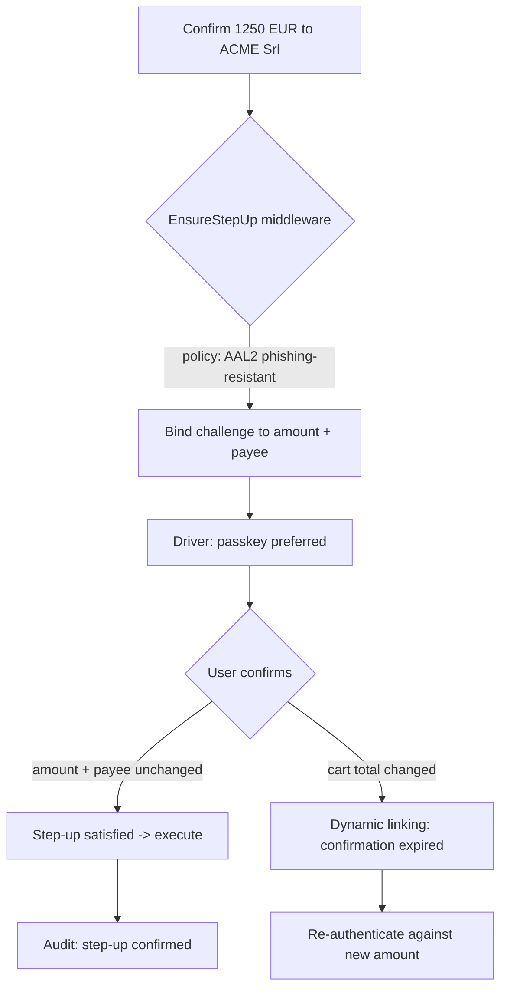
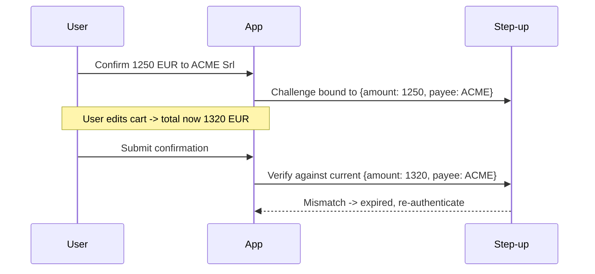

# Step-up & SCA

> By the end of this guide you'll guard a high-value action behind a per-purpose step-up policy, pick a phishing-resistant driver, and apply PSD2/SCA dynamic linking so that changing the order total invalidates the confirmation.

Logging in is one decision. Confirming *this* €1,250 order to *this* payee is another. Step-up is the second decision: a per-action, per-purpose confirmation that demands a specific assurance level right before something irreversible happens — independent of how the user originally signed in.

::: callout info
Step-up is **not** login. The user may already be authenticated at AAL1 (email-OTP). Step-up asks them to re-prove control at the assurance the *action* requires, *now*.
:::

---

## The scenario

A buyer on your B2B portal clicks **Confirm order** for a €1,250 credit purchase from **ACME Srl**. Under PSD2/SCA you must bind that confirmation to the exact amount and payee, and if the cart changes after the challenge is issued, the old confirmation must not be reusable.

## Per-purpose policy

Step-up policy is keyed by **purpose**. Each purpose declares the assurance it needs — a required AAL and, optionally, that it must be phishing-resistant. The core guard does the comparison:

```php
$assurance->satisfies(Aal::Aal2, requirePhishingResistant: true);
```

For confirming money movement, prefer **AAL2 phishing-resistant** — which in practice means a **passkey**. A TOTP or SMS-OTP reaches AAL2 but is not phishing-resistant; SMS in particular is treated as restricted.

## The flow



## Walkthrough

::: steps

### Install the package

```bash
composer require padosoft/laravel-rebel-step-up
```

### Publish and migrate

```bash
php artisan vendor:publish --tag="rebel-step-up-config"
php artisan migrate
```

### Define the policy for the purpose

Declare a purpose — for example confirming a credit order — and the assurance it requires: AAL2, phishing-resistant. Risk-based escalation can raise the bar further (e.g. unusual amount or new device), but it should never *lower* the floor the policy sets.

### Choose the driver

Drivers come from the bridge packages: Fortify password-confirm and TOTP, passkeys (WebAuthn), Laragear 2FA TOTP, otpz, spatie-otp. For a phishing-resistant AAL2 confirmation, choose the **passkey** driver. See [bridge-passkeys](/packages/bridge-passkeys).

### Gate the action with the middleware

Apply the `EnsureStepUp` middleware to the confirm route, pointing at the purpose. The action only runs once the policy is satisfied for *that* purpose with a *fresh, matching* confirmation.

### Bind the confirmation to amount and payee

Issue the challenge with a transaction context carrying **amount = €1,250** and **payee = ACME Srl**. This is PSD2/SCA dynamic linking: the confirmation is cryptographically tied to those values. If the cart total changes before the user confirms, the confirmation **expires** and they must re-authenticate against the new amount.

### Confirm the audit event

A satisfied step-up records a confirmation event with the purpose and the achieved AAL/AMR. Secrets and codes are redacted by the core `Redactor`; identifiers are keyed HMACs.

:::

## Dynamic linking, concretely



::: callout warning
Dynamic linking is what makes the confirmation meaningful. If you bind nothing, a captured confirmation could be replayed against a different amount or payee. Always pass the transaction context.
:::

## Web vs mobile

::: tabs

### Web

`fortify_password_confirm` is **web-only** — it relies on the session-backed password-confirmation flow. It's a reasonable fallback driver, but it is not phishing-resistant; prefer passkey for money movement.

### Mobile

Mobile clients can't use the web password-confirm flow. Use a **token-native** step-up driver so the confirmation works against the Sanctum token rather than a browser session.

:::

::: callout info
For card payments, SCA dynamic linking **complements** the PSP's 3DS2 — it doesn't replace it. Use both: 3DS2 at the card network, step-up dynamic linking at your application boundary.
:::

---

::: callout info
**Related**
- [Assurance theory](/concepts/assurance-theory) — how AAL/AMR and phishing-resistance are modeled.
- [laravel-rebel-step-up](/packages/step-up) — the package reference.
- [bridge-passkeys](/packages/bridge-passkeys) — the phishing-resistant AAL2 driver.
:::
