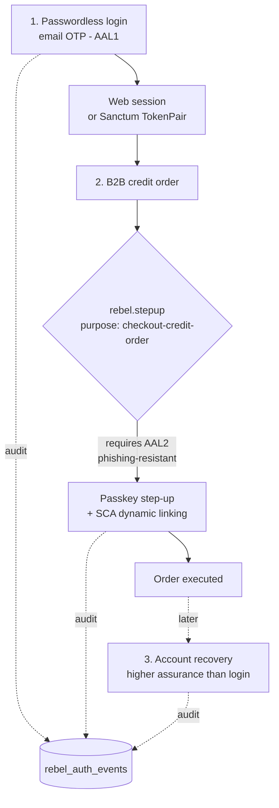

# Worked Example

> The flagship "see it all work" page. We follow a single customer — a buyer at a B2B distributor —
> through three moments where Laravel Rebel does its job: she logs in passwordlessly, she places a
> credit order that the platform makes her step up to confirm, and a week later she recovers a
> locked account. Assurance, channels, dynamic linking and the audit trail each show up exactly
> where they belong.

The cast of packages, so the story reads cleanly:

- **[`-core`](/packages/core)** — the assurance model (AAL/AMR), the contracts, and the redacting
  audit trail that everything writes to.
- **OTP / step-up** — challenges and per-action confirmation.
- **[Channels](/packages/channels)** — SMS / WhatsApp / voice delivery with fallback.
- **[Admin](/guides/admin-operations)** — where every step shows up afterward.

---

## Flow 1 — Passwordless login

She enters her email. No password is involved; the proof of identity is a one-time code.

::: steps

1. **Challenge, anti-enumeration.** The app issues an OTP challenge. Crucially, the response looks
   the same whether or not the email exists — an attacker can't use the login form to discover who
   has an account.

2. **Delivery is not authentication.** The code goes out over a [channel](/packages/channels). That
   the SMS or email was *delivered* proves nothing about identity; only a correct, timely code does.
   Keep the two ideas separate — the [admin funnels](/guides/admin-operations) track them as
   distinct steps for exactly this reason.

3. **Atomic verify.** She submits the code. Verification is single-use and atomic: the code is
   consumed the instant it succeeds, so it can't be replayed.

4. **Session or token.** On success she gets either a **web session** or, for an API/native client,
   a Sanctum **`TokenPair`** (access + refresh) — the core's `LoginResult` models both outcomes.

5. **Audit.** The core records `email_otp.verified` at **AAL1**, `amr: ['otp', 'email']`. The
   identifier is a keyed HMAC; the OTP itself is never stored — the `Redactor` guarantees it.

:::

::: callout info
Email-OTP is **AAL1** under NIST — fine for signing in, deliberately *not* enough for what comes
next. See [Assurance: AAL & AMR](/concepts/assurance-theory).
:::

---

## Flow 2 — A B2B credit order, with step-up and SCA

Logged in, she fills a cart on credit terms and hits confirm. This is money. AAL1 will not cover it.

::: steps

1. **The action declares its purpose.** The route is protected by the `rebel.stepup` middleware with
   the purpose **`checkout-credit-order`**. The middleware checks the *current* assurance against
   what this purpose requires.

2. **AAL1 is rejected, step-up is demanded.** The purpose requires **AAL2, phishing-resistant** — a
   **passkey** is preferred. Her email-OTP session does not satisfy it (`satisfies(Aal::Aal2,
   requirePhishingResistant: true)` is `false`), so she is challenged to step up *for this action*,
   not re-logged-in globally.

3. **Dynamic linking (PSD2 / SCA).** This is the part that makes step-up more than a second login.
   The challenge is **bound to the transaction**: the amount and the payee are linked into what she
   approves. Approving "€48,200 to Acme Components" is cryptographically not the same as approving
   anything else — a swapped amount or payee invalidates the confirmation.

4. **She approves with her passkey.** Phishing-resistant, AAL2, tied to this exact order.

5. **Execute and audit.** Only now does the order go through. The core records the step-up
   confirmation with its purpose, AAL2, the phishing-resistant AMR, and the linked transaction
   context — a defensible trail that *this* person approved *this* amount to *this* payee.

:::

::: callout warning
Per-action step-up is not "log in again, harder." A global re-auth would let one strong login
silently authorize a stream of later actions. Dynamic linking ties the assurance to the specific
amount and payee, so it can't be reused for a different transaction.
:::

---

## Flow 3 — Account recovery

A week later she's locked out and starts recovery. The tempting mistake is to make recovery *easier*
than login. Rebel does the opposite.

::: steps

1. **Recovery demands higher assurance than login.** Recovery hands back control of the whole
   account, so it is held to a **higher** bar than the everyday passwordless sign-in — not a lower
   one. A weak recovery path is the back door that makes a strong front door pointless.

2. **Single-use recovery code.** The recovery secret is consumed on use, exactly once. It is never
   stored in cleartext and never logged — the same `Redactor` discipline as every other secret.

3. **Audit, again.** Recovery is a security-significant event and is recorded as one, so an operator
   can later see who recovered, when, and from what context (keyed, non-PII) in the
   [audit explorer](/guides/admin-operations).

:::

---

## What you just saw, end to end

| Moment | Assurance | Channel / mechanism | Audit event |
|---|---|---|---|
| Passwordless login | AAL1 (`otp`, `email`) | OTP over a channel, with fallback | `email_otp.verified` |
| Credit-order step-up | AAL2, phishing-resistant | Passkey + SCA dynamic linking | step-up confirmed, with purpose + linked amount/payee |
| Account recovery | Higher than login | Single-use recovery code | recovery recorded |

Three different moments, one consistent spine: **assurance is a type, not a boolean; delivery is
never authentication; and every outcome lands — redacted — in `rebel_auth_events`.**

::: callout tip
Watch all of this populate in real time in the [SOC dashboard](/guides/admin-operations): the OTP
funnel for Flow 1, the step-up funnel for Flow 2, and the audit explorer for all three.
:::

---

::: callout info
**Related**

- The model behind it all: [Assurance: AAL & AMR](/concepts/assurance-theory) · [Step-up & SCA](/packages/step-up)
- Delivery: [Channels & Fallback](/packages/channels)
- Operating it: [Admin Operations](/guides/admin-operations) · [AI Guard](/guides/ai-guard)
- The foundation: [the core package](/packages/core)
:::
