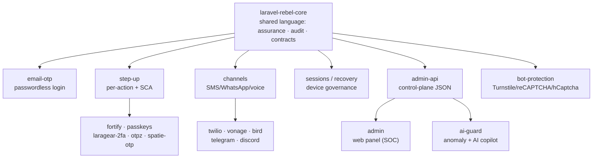

# Laravel Rebel


> **Laravel Rebel turns Laravel Fortify into an enterprise authentication _control plane_.**
> Passwordless OTP, passkey-first login, risk-based step-up, PSD2/SCA, multi-tenant, full audit,
> a web admin panel and an AI security copilot — split into **22 small, composable packages** so you
> install only what you need.

::: callout info
**New here? Read this page top to bottom.** In five minutes you'll know exactly what Rebel is, the
problems it solves, why it's different, and where to click next. The whole ecosystem is documented on
this one site — every package README points back here.
:::

---

## What Laravel Rebel is — in one minute

Laravel already ships **Fortify** (login, registration, password reset, TOTP 2FA, passkeys). Rebel
**does not replace it** — it sits _on top_ and adds the things a real **enterprise / ecommerce /
fintech** product needs but the framework leaves to you:

- **Passwordless login** — Shopify-style email-OTP, and **passkey-first** (the most secure, phishing-resistant).
- **Step-up** — re-prompt for a strong confirmation _only_ for sensitive actions (change email, credit order, download invoice…), at an assurance level that matches the risk.
- **SCA / PSD2 dynamic linking** — payment/credit-order confirmations cryptographically bound to **amount + payee** (EU compliant).
- **SMS / WhatsApp / voice channels** — with provider fallback and anti toll-fraud / IRSF defenses.
- **Multi-tenant, audit, web admin panel, AI guard** — the operational layer SaaS teams actually run on.

Everything is keyed on **NIST assurance levels** (AAL/AMR) and **GDPR-safe by design** (no PII in
cleartext, ever).

> **In one line:** *Rebel is the enterprise auth layer Laravel doesn't ship — assurance-aware, GDPR-safe, fully audited, and composable.*

---

## The problem it solves

Every team that outgrows "email + password + maybe TOTP" hits the same wall. Here's the gap Rebel closes:

| Without Rebel | With Rebel |
|---|---|
| You hand-roll OTP flows, rate limiting and anti-enumeration — and get the edge cases wrong. | Battle-tested passwordless flows with anti-enumeration and multi-dimensional rate limiting, out of the box. |
| "2FA" is a single on/off flag. Nothing distinguishes an SMS code from a hardware passkey. | A **first-class assurance model** (NIST AAL/AMR) that *knows* email-OTP can't cover an action that needs a passkey. |
| Sensitive actions (change payout IBAN, big order) are protected the same as login — or not at all. | **Per-action step-up** with risk-based escalation and **PSD2/SCA dynamic linking**. |
| IPs, emails and user-agents sit in your logs and DB in cleartext — a GDPR liability. | Every identifier stored as a **keyed HMAC** with a versioned pepper and rotation. Never reversible. |
| OTP codes and secrets leak into logs and audit trails. | An audit trail with **automatic secret redaction** — secrets are physically `[REDACTED]` before write. |
| You bolt SMS onto one provider and pray it never goes down or gets toll-fraud'd. | A **channel abstraction** with provider fallback, cooldowns and anti toll-fraud/IRSF defenses. |
| No single place to see logins, OTP funnels, provider health, anomalies or compliance. | A **web admin panel + JSON control-plane API** and an **AI copilot** that explains anomalies. |

---

## Who it's for

::: grids
::: grid
::: card "Ecommerce & marketplaces" icon:shopping-cart
Passwordless customer login, SMS/WhatsApp verification with fallback, step-up on risky checkout and account changes, multi-tenant per brand/country.
:::
:::
::: grid
::: card "Fintech & B2B payments" icon:landmark
PSD2/SCA dynamic linking on credit orders and payouts, high-assurance recovery, hardware-passkey step-up, a full audit trail for auditors.
:::
:::
::: grid
::: card "SaaS platforms" icon:layers
Multi-tenant isolation, session/device governance, "log out everywhere", anomaly detection and a security operations dashboard.
:::
:::
::: grid
::: card "Regulated & enterprise" icon:shield-check
NIST 800-63B assurance, GDPR-safe storage by design, queued/Horizon-ready audit, swappable contracts to meet your SIEM and infra.
:::
:::
:::

---

## Why Rebel is different — the moats

These are the things you **won't** get by gluing together off-the-shelf packages or rolling your own.

::: grids
::: grid
::: card "Assurance that actually guards" icon:lock
A first-class **NIST AAL/AMR** model with a `satisfies()` guard. Email-OTP (AAL1) **cannot** satisfy an action that requires a phishing-resistant passkey (AAL2/3). The framework enforces it — not your `if` statements.
:::
:::
::: grid
::: card "GDPR-safe by design" icon:fingerprint
IPs, user-agents and identifiers are stored as **keyed HMACs** with a **versioned pepper + rotation**. No cleartext PII, anywhere — and you can rotate the pepper without breaking historical lookups.
:::
:::
::: grid
::: card "Audit that can't leak secrets" icon:scroll-text
A `Redactor` strips OTPs, recovery codes, tokens and webhook secrets **before** they're written. Audit is `sync` or `queue` (Horizon-ready), enriched with country/device, persisted to `rebel_auth_events` — never just the session.
:::
:::
::: grid
::: card "PSD2 / SCA dynamic linking" icon:banknote
Step-up confirmations are cryptographically **bound to amount + payee**. Change the cart total and the confirmation expires — exactly what EU regulation requires for B2B credit orders.
:::
:::
::: grid
::: card "Anti toll-fraud channels" icon:radio-tower
The channel layer ships **IRSF / toll-fraud** defenses, cooldowns, multi-dimensional rate limiting and **provider fallback** — so one SMS provider outage or attack doesn't take down verification.
:::
:::
::: grid
::: card "Telemetry completeness" icon:activity
Every channel reports sends, **delivery receipts**, cost, country, devices and anomalies through one `AuditLogger` contract — so the admin panel shows the truth, never faked data, never an empty dashboard.
:::
:::
::: grid
::: card "Composable contracts" icon:puzzle
Every moving part — `TokenIssuer`, `RiskEvaluator`, `SessionRegistry`, `DeviceTrust`, `BotProtection`, `RateLimiter` — is a **contract** with a sane default you can swap. Bind your SIEM, your risk engine, your infra.
:::
:::
::: grid
::: card "AI copilot, not autopilot" icon:bot
`ai-guard` detects anomalies with **deterministic rules**; the optional AI only **explains and suggests** on sanitized prompts (no PII, no OTP) with human review. It never makes destructive decisions on its own.
:::
:::
:::

---

## See it: the Security Operations panel

Rebel ships a real **web admin panel** (Blade + AJAX + vanilla JS, no mandatory JS framework) to
monitor logins, OTP/step-up funnels, provider health, audit, anomalies and compliance.


---

## Rebel vs. the alternatives (at a glance)

| Capability | **Laravel Rebel** | Fortify alone | Hand-rolled | SaaS IdP (Auth0/Okta) |
|---|:---:|:---:|:---:|:---:|
| First-class NIST AAL/AMR assurance model | ✅ | ❌ | ❌ | ➖ |
| Per-action step-up + PSD2/SCA dynamic linking | ✅ | ❌ | ❌ | ➖ |
| GDPR-safe keyed-HMAC PII storage with rotation | ✅ | ❌ | ❌ | ➖ |
| Audit trail with automatic secret redaction | ✅ | ❌ | ❌ | ➖ |
| SMS/WhatsApp/voice with provider fallback + anti-fraud | ✅ | ❌ | ❌ | ➖ |
| Self-hosted, you own the data | ✅ | ✅ | ✅ | ❌ |
| Swappable contracts (risk, sessions, channels…) | ✅ | ❌ | ➖ | ❌ |
| Runs inside your Laravel app, your DB | ✅ | ✅ | ✅ | ❌ |

> Legend: ✅ built-in · ➖ partial / extra cost / not exposed · ❌ not available.

**[→ See the full competitive breakdown](/ecosystem/why-rebel)** — detailed matrices vs Fortify,
hand-rolled primitives, Spatie, and hosted IdPs.

---

## The ecosystem at a glance

Rebel is **one core + feature packages + provider bridges**. The core defines the shared language;
everything else plugs into it.



**[→ Package Map](/ecosystem/package-map)** · **[→ Dependency Graph](/ecosystem/dependency-graph)** · **[→ Capability Matrix](/ecosystem/capability-matrix)**

---

## Start in 30 seconds

::: steps
1. **Install the bundle**
   ```bash
   composer require padosoft/laravel-rebel-auth
   ```
   The `auth` meta-package pulls in the recommended suite. Need just the primitives? `composer require padosoft/laravel-rebel-core`.

2. **Set the pepper** (the secret behind every keyed HMAC)
   ```dotenv
   REBEL_PEPPER_V1="$(php -r 'echo bin2hex(random_bytes(32));')"
   REBEL_PEPPER_CURRENT=1
   ```

3. **Migrate & validate**
   ```bash
   php artisan migrate
   php artisan rebel:validate-config   # fail-fast, CI-friendly
   ```
:::

**[→ Full Quickstart](/quickstart)** · **[→ Install Matrix](/install-matrix)** · **[→ Worked Example](/guides/worked-example)**

---

## Batteries included for AI-assisted development

Every Rebel repo ships **AI batteries** — a `CLAUDE.md` working guide, an `AGENTS.md` workflow
contract, and invocable `.claude/skills/` encoding the TDD loop, PHPStan-max recipes and the
security/telemetry rules. Open any package in Claude Code, Cursor, Copilot or Codex and your agent
already knows the house rules — PRs land green on the first try.

---

## Package index

All 22 packages, grouped by what they do. Each links to its reference page and repo.

| Package | Responsibility | Composer name |
|---|---|---|
| [`laravel-rebel-core`](/packages/core) | Shared primitives: assurance (AAL/AMR), security context, audit, keyed hashing, contracts. The foundation. | `padosoft/laravel-rebel-core` |
| [`laravel-rebel-auth`](/packages/auth) | Meta-package: installs and wires the recommended suite together. Start here. | `padosoft/laravel-rebel-auth` |
| [`laravel-rebel-email-otp`](/packages/email-otp) | Passwordless email-OTP login (web + mobile/Sanctum), anti-enumeration, rate-limited. | `padosoft/laravel-rebel-email-otp` |
| [`laravel-rebel-step-up`](/packages/step-up) | Per-action step-up with risk-based escalation and PSD2/SCA dynamic linking. | `padosoft/laravel-rebel-step-up` |
| [`laravel-rebel-channels`](/packages/channels) | SMS/WhatsApp/voice abstraction: fallback, cooldown, rate limiting, anti toll-fraud/IRSF. | `padosoft/laravel-rebel-channels` |
| [`laravel-rebel-channel-twilio`](/packages/channel-twilio) | Twilio provider: Verify (SMS/WhatsApp/voice), delivery, signed webhooks. | `padosoft/laravel-rebel-channel-twilio` |
| [`laravel-rebel-channel-vonage`](/packages/channel-vonage) | Vonage provider: Verify (SMS/voice), SMS delivery, signed delivery receipts. | `padosoft/laravel-rebel-channel-vonage` |
| [`laravel-rebel-channel-bird`](/packages/channel-bird) | Bird (ex-MessageBird) provider: Verify API (SMS), delivery, signed webhooks. | `padosoft/laravel-rebel-channel-bird` |
| [`laravel-rebel-channel-telegram`](/packages/channel-telegram) | Telegram bot channel: deliver OTP codes and security alerts to a chat. | `padosoft/laravel-rebel-channel-telegram` |
| [`laravel-rebel-channel-discord`](/packages/channel-discord) | Discord channel: ship SOC alerts (anomalies, lockouts, high-risk events) via webhook. | `padosoft/laravel-rebel-channel-discord` |
| [`laravel-rebel-sessions`](/packages/sessions) | Device/session registry, logout-everywhere, refresh-token rotation with reuse detection. | `padosoft/laravel-rebel-sessions` |
| [`laravel-rebel-recovery`](/packages/recovery) | High-assurance account recovery: single-use HMAC-hashed backup codes, anti-ATO. | `padosoft/laravel-rebel-recovery` |
| [`laravel-rebel-bot-protection`](/packages/bot-protection) | Anti-bot/CAPTCHA gate: Turnstile, reCAPTCHA v3, hCaptcha — fail-closed, audited. | `padosoft/laravel-rebel-bot-protection` |
| [`laravel-rebel-bridge-fortify`](/packages/bridge-fortify) | Bridge Fortify: password-confirm/passkey/TOTP as step-up drivers, passkey-first login. | `padosoft/laravel-rebel-bridge-fortify` |
| [`laravel-rebel-bridge-passkeys`](/packages/bridge-passkeys) | WebAuthn passkey step-up driver (spatie/laravel-passkeys), phishing-resistant AAL3. | `padosoft/laravel-rebel-bridge-passkeys` |
| [`laravel-rebel-bridge-laragear-2fa`](/packages/bridge-laragear-2fa) | TOTP via laragear/two-factor as an AAL2 step-up driver, recovery-code aware. | `padosoft/laravel-rebel-bridge-laragear-2fa` |
| [`laravel-rebel-bridge-spatie-otp`](/packages/bridge-spatie-otp) | Email/SMS OTP via spatie/laravel-one-time-passwords as an AAL2 step-up driver. | `padosoft/laravel-rebel-bridge-spatie-otp` |
| [`laravel-rebel-bridge-otpz`](/packages/bridge-otpz) | Email magic-code OTP via benbjurstrom/otpz as a step-up driver (AAL2). | `padosoft/laravel-rebel-bridge-otpz` |
| [`laravel-rebel-admin-api`](/packages/admin-api) | Control-plane JSON API: metrics, audit explorer, OTP/step-up funnels, provider health. | `padosoft/laravel-rebel-admin-api` |
| [`laravel-rebel-admin`](/packages/admin) | Web Admin Panel (Blade + AJAX + vanilla JS): the security operations dashboard. | `padosoft/laravel-rebel-admin` |
| [`laravel-rebel-ai-guard`](/packages/ai-guard) | Anomaly detection + AI copilot that explains (never decides), on sanitized prompts. | `padosoft/laravel-rebel-ai-guard` |
| [`laravel-rebel-demo`](/packages/demo) | Demo / integration app for the whole suite — a reference wiring you can read. | `padosoft/laravel-rebel-demo` |

---

## First principles

Laravel Rebel separates **primitive assurance concepts** from delivery channels, step-up decisions,
admin operations, AI-assisted investigation, recovery, session governance and framework bridges. The
shared language lives in `laravel-rebel-core`; every other package builds on it without re-defining
the global assurance model. That boundary is what lets the suite stay modular while remaining
auditable end-to-end.

::: callout tip
**Where to go next:** new to the concepts? Start with [Motivation](/concepts/motivazione) and
[Assurance Theory](/concepts/assurance-theory). Ready to build? Jump to the
[Quickstart](/quickstart) or a [guide](/guides/passwordless-login). Evaluating? Read
[Why Rebel](/ecosystem/why-rebel).
:::
